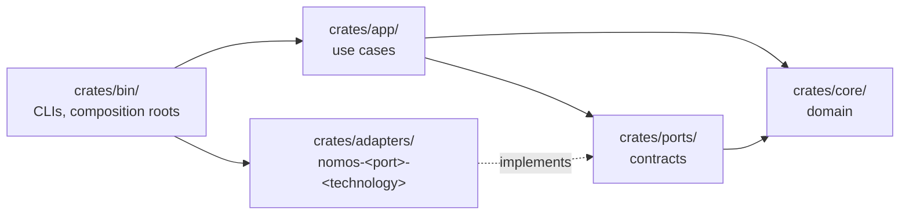

# Contributing to Nomos

Thank you for your interest in Nomos. The project is at the skeleton stage.
The most valuable contributions right now are careful ones: sharper semantics,
clearer boundaries, and tests that pin down invariants.

## Before you start

Read these, in order:

1. [README](README.md): what Nomos is for.
2. [Project specification](docs/PROJECT-SPEC.md): the model, the vocabulary and the safety invariants N1–N12.
3. [Architecture](docs/architecture/): how the code is organised.
4. [ADR 0000](docs/adr/0000-foundations.md): the hexagonal layout, the dependency rule and the pinned toolchain.

For anything larger than a small fix, open an issue first so the design can be
agreed before code is written.

## Toolchain

Rust is pinned to **1.98.1** in `rust-toolchain.toml`. With rustup installed,
the right toolchain is selected automatically.

Run these before opening a pull request. CI runs the same checks:

```sh
cargo fmt    --all --check
cargo clippy --workspace --all-targets -- -D warnings
cargo test   --workspace
```

## Where code goes

The workspace is arranged as ports and adapters:



- **Dependencies point inward only.** `core/` depends on nothing. `app/` never
  depends on `adapters/`. Only `bin/` wires adapters to ports.
- **One port per adapter.** A new technology (a storage engine, a secrets
  backend, a transport) is a new adapter crate named
  `nomos-<port>-<technology>`. It does not add a dependency to the core.
- **Any new crate, port or change to the dependency rule needs an ADR.**

## Design rules

- **Vocabulary.** Use the terms in spec §3 exactly: Canon, Trait, Cipher,
  Variance, Trace, Enforce, Event, Event Log. One concept gets one name.
- **Invariants first.** A change must not weaken N1–N12. If it touches one,
  say which and add or extend a test for it.
- **Typed operations, not shell.** Substrate uses native interfaces such as
  D-Bus and syscalls. Arbitrary command execution is not a reconciliation
  primitive.
- **No secret plaintext.** Cipher values never appear in Events, Plans, Trace
  output, errors or logs.
- **Deterministic by default.** Avoid depending on iteration order, hash seeds
  or wall-clock time in anything that feeds compilation or planning.

## Documentation

- Technical material belongs in `docs/`. The README tells the story.
- **Diagrams are Mermaid only.** GitHub renders Mermaid. ASCII art and
  box-drawing diagrams break across fonts and viewers, so don't add them.
  Use fenced code blocks only for code, commands, pseudocode and sample output.
- Mathematical statements use GitHub math (`$...$`, `$$...$$`).
- Algorithms and proofs go in `docs/formal/`. Machine-checked TLA+ models go in `formal/tla/`.
- Decisions go in `docs/adr/`, numbered sequentially. Use the Status, Date,
  Context, Decision, Consequences layout.

## Commits and pull requests

- Keep each pull request focused on one change. Separate refactors from behaviour changes.
- Write commit messages in the imperative ("Add Warp cycle detection"). Explain *why* in the body.
- Update docs and ADRs in the same pull request as the change they describe.
- CI must be green before review.

## Reporting security issues

Do not open a public issue. Follow [SECURITY.md](SECURITY.md).

## License

Nomos is licensed under the [Apache License 2.0](LICENSE). By submitting a
contribution, you agree that it is licensed under the same terms, as described
in section 5 of the license.
