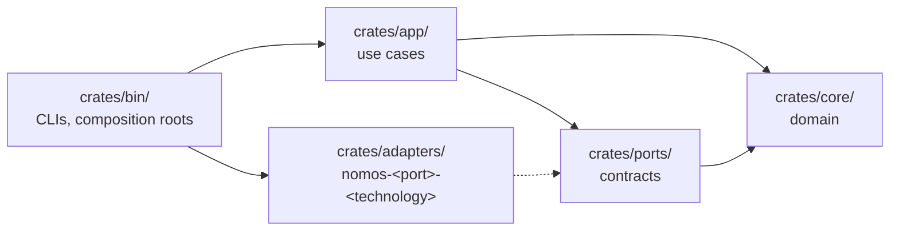

# Contributing to Nomos

Thanks for being here. Nomos is at the skeleton stage, so the most valuable contributions are careful ones: sharper semantics, cleaner boundaries, and tests that pin invariants down.

## Before You Start

Read these, in order:

1. [README](README.md): what Nomos is for.
2. [Project specification](docs/PROJECT-SPEC.md): the model, the vocabulary, and safety invariants N1–N12.
3. [Architecture](docs/architecture/): how the code is organized.
4. [Architecture decision record (ADR) 0000](docs/adr/0000-foundations.md): the hexagonal layout, the dependency rule, and the pinned toolchain.
5. [Research](docs/research/): what has been questioned, what was corrected, and which experiments come next.

For anything bigger than a small fix, open an issue first. Agreeing on the design is cheaper than rewriting the code.

## Toolchain

Rust is pinned to **1.98.1** in `rust-toolchain.toml`. With rustup installed, the right toolchain is selected automatically.

Run these before opening a pull request. CI runs the same checks.

```sh
cargo fmt    --all --check
cargo check  --workspace --locked
cargo clippy --workspace --all-targets --locked -- -D warnings
cargo test   --workspace --locked
cargo xtask  check-layers
cargo xtask  check-core-purity
cargo xtask  research verify-all docs/research
cargo xtask  check-trust-boundary --base origin/main
cargo xtask  receipts validate
cargo xtask  mutants semantic
```

`check-layers` is the dependency rule as a check, over the declared and resolved graphs ([ADR 0000](docs/adr/0000-foundations.md)); dev and build dependencies get no exemption, and nothing depends on a `bin/` crate. `check-core-purity` holds the core crates to `crates/core/PURITY.toml` ([ADR 0016](docs/adr/0016-core-purity.md)). `check-trust-boundary` checks that every commit on your branch declares its specification and verifier changes (below). `receipts validate` and `mutants semantic` check the records and the semantic-mutant corpus. Each gate is tested against fixtures under `tests/fixtures/`, one case per failure code, and each failure prints its code.

## Where Code Goes

The workspace is arranged as ports and adapters:



- **Dependencies point inward.** `core/` depends on nothing. `app/` never depends on `adapters/`. Only `bin/` wires adapters to ports.
- **One port per adapter.** A new technology, such as a storage engine, a secrets backend, or a transport, is a new adapter crate named `nomos-<port>-<technology>`. It never adds a dependency to the core.
- **ADRs for structure.** Any new crate, new port, or change to the dependency rule needs an ADR.

## Design Rules

- **Vocabulary.** Use the terms from spec §3 exactly: Canon, Condition, Observation, Assessment, Variance, Indeterminate, Obligation, Settled, Action, Plan, Trait, Cipher, Trace, Enforce, Event, Event Log. One concept, one name. A failed observation is Indeterminate, never a Variance.
- **Invariants first.** A change must not weaken N1–N12. If it touches one, say which, and add or extend a test for it.
- **Typed operations, not shell.** Substrate uses native interfaces such as D-Bus and syscalls. Arbitrary command execution is not a reconciliation primitive.
- **No secret plaintext.** Cipher values never appear in Events, Plans, Trace output, errors, or logs.
- **Deterministic by default.** Nothing that feeds compilation or planning depends on iteration order, hash seeds, or wall-clock time.
- **Tooling is Rust.** Checks, generators, and reproducers live in `crates/bin/nomos-xtask` and run as `cargo xtask <command>` ([ADR 0003](docs/adr/0003-xtask-tooling-crate.md)), not in scripts.
- **Specifications are protected.** A check that passes because its specification was weakened proves nothing. Loosened postconditions, added assumptions, ignored tests, and code moved out of a verifier's view are trust-boundary changes: keep them in their own commit, declare them, and say what they weaken.
- **Core crates are pure.** `crates/core/` is `no_std`, panic-free outside tests, and takes external dependencies only through `crates/core/PURITY.toml`. Effects are data the application layer performs ([core-purity.md](docs/formal/core-purity.md)).

## How Code Is Judged

Most code here is written by language models and reviewed by people, and the rules assume it ([ADR 0015](docs/adr/0015-generator-verifier-development-model.md)). The short version, for a human contributor:

- **Oracle changes are declared.** `docs/PROJECT-SPEC.md`, `docs/formal/`, `formal/`, and `docs/adr/` are the specification; `crates/bin/nomos-xtask/`, `tests/`, `verification/`, `crates/core/PURITY.toml`, `.github/workflows/`, `.cargo/`, the root `Cargo.toml`, and `rust-toolchain.toml` are the verifier. A commit that changes one carries `Trust-Boundary: specification` or `Trust-Boundary: verifier` in its body and changes no implementation crate. One that adds an ignored test, a skipped mutant, an allowed panic lint, or an assumption carries `Trust-Boundary: escape-hatch`. CI fails otherwise. The line asks for review; it is not a pass.
- **A test is evidence for a property when its oracle comes from outside the code:** an invariant in `docs/formal/`, an exhaustive truth table, an independently written reference, a metamorphic relation, or a proof obligation. A test written alongside the code it tests is a regression test, which is useful and different.
- **Records, not claims.** A check counts when a receipt under `verification/receipts/` says it ran, written by `cargo xtask receipts record`. The [verification matrix](docs/formal/verification-matrix.md) is filled from receipts and result records only; a row without one says *not run*.
- **Mutation testing has no score.** `cargo mutants` runs on a schedule; every survivor is classified by a person. The [semantic-mutant corpus](tests/semantic-mutants/README.md) names the wrong behaviors each kernel must reject before it lands.
- **Merge with merge commits**, so declarations survive.

## Documentation

### Voice and Mechanics

Prose follows the [Kennedy prose specification](docs/style/prose-spec.yaml). Direct, compact, skeptical, and built on mechanisms rather than labels. Humor is welcome when it is dry and rare. [docs/style/README.md](docs/style/README.md) has the short form, the formatting mechanics, and which rules are automated.

CI runs the prose linter as an advisory check that never blocks a merge. Running it locally first saves a round trip:

```sh
.vale/lint.sh
```

### Diagrams

- **Mermaid only.** GitHub renders Mermaid. ASCII art and box-drawing characters fall apart across fonts and viewers. Fenced code blocks are for code, commands, pseudocode, and sample output.
- **No labels on arrows or state transitions.** GitHub's renderer can fail on labeled arrows (`A -- text --> B`, `A -->|text| B`, `S1 --> S2: text`) with "Could not find a suitable point for the given distance". Put the text in a node, route the arrow through a small label node (`A --> L(["text"]) --> B`), or explain transitions in a table under the diagram.

### Where Documents Go

- Algorithms and proofs go in `docs/formal/`. Machine-checked TLA+ models go in `formal/tla/`.
- Decisions go in `docs/adr/`, numbered sequentially, with the Status, Date, Context, Decision, and Consequences layout.

## Commits, Branches, and Pull Requests

- Keep each pull request to one change. Refactors and behavior changes go separately, and oracle changes go in their own commits with their `Trust-Boundary:` line.
- Write commit subjects in the imperative ("Add Warp cycle detection") and explain *why* in the body.
- Milestone work lives on `milestone/<nn>-<name>`, named from the [grounding plan](docs/research/2026-09-28-typed-core/grounding-plan.md); a milestone is referred to by that name, never by a pull-request number.
- Update docs and ADRs in the same pull request as the change they describe.
- CI is green before review.

## Security Issues

Do not open a public issue. Follow [SECURITY.md](SECURITY.md).

## License

Nomos is licensed under the [Apache License 2.0](LICENSE). By submitting a contribution, you agree that it is licensed under the same terms, as described in section 5 of the license.
