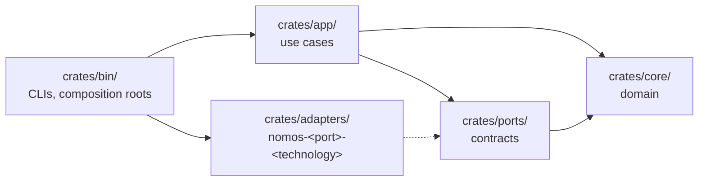

# Contributing to Nomos

Thanks for being here. Nomos is at the skeleton stage, so the most valuable contributions are careful ones: sharper semantics, cleaner boundaries, and tests that pin invariants down.

## Before You Start

Read these, in order:

1. [README](README.md): what Nomos is for.
2. [Project specification](docs/PROJECT-SPEC.md): the model, the vocabulary, and safety invariants N1–N12.
3. [Architecture](docs/architecture/): how the code is organized.
4. [Architecture decision record (ADR) 0000](docs/adr/0000-foundations.md): the hexagonal layout, the dependency rule, and the pinned toolchain.

For anything bigger than a small fix, open an issue first. Agreeing on the design is cheaper than rewriting the code.

## Toolchain

Rust is pinned to **1.98.1** in `rust-toolchain.toml`. With rustup installed, the right toolchain is selected automatically.

Run these before opening a pull request. CI runs the same checks.

```sh
cargo fmt    --all --check
cargo clippy --workspace --all-targets -- -D warnings
cargo test   --workspace
```

## Where Code Goes

The workspace is arranged as ports and adapters:



- **Dependencies point inward.** `core/` depends on nothing. `app/` never depends on `adapters/`. Only `bin/` wires adapters to ports.
- **One port per adapter.** A new technology, such as a storage engine, a secrets backend, or a transport, is a new adapter crate named `nomos-<port>-<technology>`. It never adds a dependency to the core.
- **ADRs for structure.** Any new crate, new port, or change to the dependency rule needs an ADR.

## Design Rules

- **Vocabulary.** Use the terms from spec §3 exactly: Canon, Trait, Cipher, Variance, Trace, Enforce, Event, Event Log. One concept, one name.
- **Invariants first.** A change must not weaken N1–N12. If it touches one, say which, and add or extend a test for it.
- **Typed operations, not shell.** Substrate uses native interfaces such as D-Bus and syscalls. Arbitrary command execution is not a reconciliation primitive.
- **No secret plaintext.** Cipher values never appear in Events, Plans, Trace output, errors, or logs.
- **Deterministic by default.** Nothing that feeds compilation or planning depends on iteration order, hash seeds, or wall-clock time.

## Documentation

### Voice and Mechanics

Prose follows the [Kennedy prose specification](docs/style/prose-spec.yaml). Direct, compact, skeptical, and built on mechanisms rather than labels. Humor is welcome when it is dry and rare. [docs/style/README.md](docs/style/README.md) has the short form, the formatting mechanics, and which rules are automated.

Run the prose linter before opening a pull request:

```sh
.vale/lint.sh
```

### Diagrams

- **Mermaid only.** GitHub renders Mermaid. ASCII art and box-drawing characters fall apart across fonts and viewers. Fenced code blocks are for code, commands, pseudocode, and sample output.
- **No labels on arrows or state transitions.** GitHub's renderer can fail on labeled arrows (`A -- text --> B`, `A -->|text| B`, `S1 --> S2: text`) with "Could not find a suitable point for the given distance". Put the text in a node, route the arrow through a small label node (`A --> L(["text"]) --> B`), or explain transitions in a table under the diagram.

### Where Documents Go

- Algorithms and proofs go in `docs/formal/`. Machine-checked TLA+ models go in `formal/tla/`.
- Decisions go in `docs/adr/`, numbered sequentially, with the Status, Date, Context, Decision, and Consequences layout.

## Commits and Pull Requests

- Keep each pull request to one change. Refactors and behavior changes go separately.
- Write commit subjects in the imperative ("Add Warp cycle detection") and explain *why* in the body.
- Update docs and ADRs in the same pull request as the change they describe.
- CI is green before review.

## Security Issues

Do not open a public issue. Follow [SECURITY.md](SECURITY.md).

## License

Nomos is licensed under the [Apache License 2.0](LICENSE). By submitting a contribution, you agree that it is licensed under the same terms, as described in section 5 of the license.
