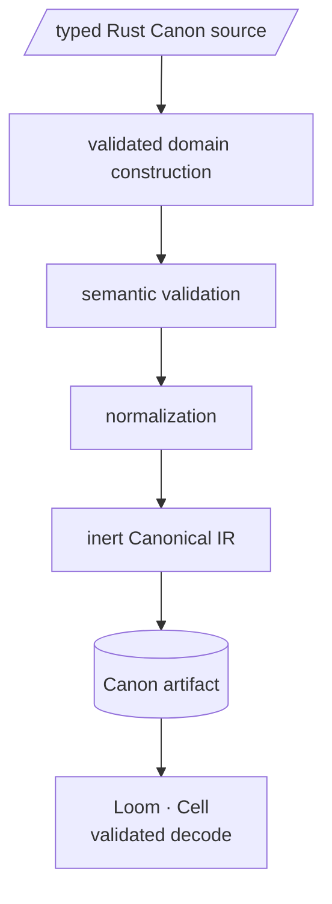

# Canon

Canon is compiled desired intent: Conditions on resources and the relationships between them. This page is the authoring reference. The authoring API is not designed yet, so the page states what is decided, what the pipeline guarantees, and what is still open.

## Decided

| Decision | Record |
| --- | --- |
| Canon is authored with typed Rust models | [ADR 0004](adr/0004-rust-typed-canon.md) |
| Loom and Cell consume an inert, normalized artifact and never execute Rust Canon source | [ADR 0004](adr/0004-rust-typed-canon.md) |
| A Condition is a proposition reality is expected to satisfy; an Observation is evidence; an Assessment is Satisfied, Variance, or Indeterminate | [ADR 0005](adr/0005-assessment-vocabulary.md) |
| Assessment, planning, and verification are core semantics, not adapter behavior | [ADR 0006](adr/0006-kernel-contract.md) |

## Pipeline

- **Validated domain construction.** The authoring API cannot build a contradictory value. A file that is absent has no contents to require.
- **Semantic validation.** Checks that span values: every `requires` names a resource that exists, identifiers are unique, sizes are within bounds.
- **Normalization.** Semantically equal Canons become byte-equal IR, so identity follows meaning.
- **Inert IR and artifact.** Data only. The Canon's Rust ran once, in an isolated build job with declared inputs and no host credentials, and never runs again.
- **Validated decode.** Loom and Cell decode the artifact into untrusted data-transfer objects and convert them through the same validator the authoring API uses. An artifact that fails conversion produces no Plan.

## Open

These are recorded in spec §62 and are not decided by anything on this page:

- the artifact encoding, a restricted deterministic profile of Concise Binary Object Representation (CBOR) or canonical JSON
- the artifact container and its file extension
- the content hash algorithm and profile behind `CanonID`
- artifact signing
- the extensibility model for resource kinds
- logical composition of Conditions beyond a set
- Trait-dependent expressions
- the authoring API form, builders or a macro layer

Spec [§5–§7](PROJECT-SPEC.md#5-canon) holds the illustrative authoring example, the compilation stages, and Cipher references.
