# Nomos Project Specification

| | |
| --- | --- |
| Status | Draft v0.1 |
| Project | Nomos |
| Organization | Moiric |
| Language | Rust |
| Initial platform | Linux, with Debian as the reference distribution |
| Purpose | Declarative host-state convergence, distributed execution, and fleet coordination |

## 1. Definition

Nomos (Ancient Greek νόμος: law, custom, established order) is a host-state convergence and distributed control system.

Nomos describes how machines should be, observes how they are, computes the difference, builds a safe execution plan, applies the required changes, verifies their effects, and records every transition in an immutable, append-only Event Log.

Its fundamental control relationship:

$$
\begin{aligned}
&\mathit{DesiredState} \xrightarrow{\text{compare}} \mathit{ObservedState} \\
&\mathit{Variance} = \mathit{DesiredState} - \mathit{ObservedState} \\
&\mathit{Plan} = \mathrm{compile}(\mathit{Variance})
\end{aligned}
$$

applied until $\mathit{ObservedState} \approx \mathit{DesiredState}$.

Nomos is not Salt rewritten in Rust. Salt is one source of lessons. So are reconciliation systems, workflow engines, schedulers, operating systems, databases, formal methods, security systems, and distributed-systems research.

The goal is a smaller, more principled model.

## 2. Core Architecture

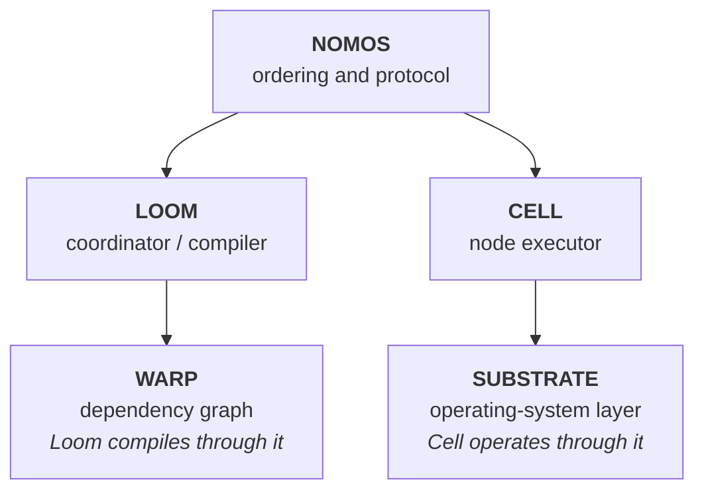

### Nomos (`nomos`)

The project, protocol, specification, schemas, semantics, and shared model. Nomos defines:

- Canon semantics
- resource identity
- reconciliation semantics
- protocol semantics
- Event schemas
- the Action lifecycle
- compatibility and versioning rules
- safety invariants

Nomos itself is not a daemon.

### Loom (`nomos-loom`)

The fleet coordinator. Loom:

- accepts Canon
- tracks Cells
- receives Traits
- resolves targets
- evaluates Variance
- invokes Warp compilation
- produces Plans
- dispatches Actions
- enforces concurrency constraints
- ingests Events
- maintains materialized fleet state
- manages execution leases
- coordinates multi-node convergence

Loom is an authority, not a message broker. Version 0 supports exactly one authoritative Loom. High availability and consensus wait until there is evidence that multiple authoritative replicas are needed.

### Cell (`nomos-cell`)

The node-resident executor. A Cell:

- discovers local Traits
- observes Substrate resources
- receives Plans
- validates authorization and freshness
- executes Actions
- verifies postconditions
- performs standalone convergence
- records Events locally
- survives temporary Loom disconnection
- forwards buffered Events after reconnection

A Cell is autonomous enough to work without Loom:

```sh
nomos-cell trace --canon local.yaml
nomos-cell enforce --canon local.yaml
```

Loom adds fleet coordination. It is not a dependency for basic reconciliation.

### Warp (`nomos-warp`)

The dependency and execution-graph engine. Warp takes declarative resources and Variance and produces a directed acyclic graph (DAG) of executable Actions. It handles:

- dependency resolution
- graph construction
- cycle detection
- topological ordering
- conditional activation
- conflict detection
- concurrency frontier calculation
- failure propagation
- graph validation

`petgraph` is a suitable first implementation. Its topological sort detects cycles and runs in $O(|V| + |E|)$.

### Substrate (`nomos-substrate`)

The operating-system boundary. Substrate turns strongly typed Nomos operations into concrete Linux interactions with files, directories, users and groups, packages, systemd units, sysctl, processes, cgroup v2, `/proc`, `/sys`, network interfaces, permissions, and ownership.

Substrate prefers native APIs to shell execution. This:


not this:


systemd exposes units, jobs, state, and operations through its D-Bus object model. That is a far stronger contract than parsing output written for humans.

## 3. Public Vocabulary

| Term | Definition |
| --- | --- |
| Canon | Declarative description of desired state |
| Trait | Typed observation about a Cell or its environment |
| Cipher | Reference to protected secret material |
| Variance | Difference between desired and observed state |
| Trace | Non-mutating evaluation of Variance |
| Enforce | Reconciliation of observed state toward Canon |
| Event | Immutable record of a meaningful transition |
| Event Log | Append-only, ordered collection of Events |

Alternative names are discarded on purpose. There is no "Pattern/Canon", "Flaw/Variance", "Audit/Trace", or "Weave/Enforce". One concept gets one name.

## 4. Traits

A Trait is not necessarily immutable. `architecture = x86_64` is very stable. `kernel`, `ip_address`, `package_version`, and `memory_available` are not. So:

$$
\mathit{Trait} = \mathit{Value} + \mathit{Provenance} + \mathit{ObservationTime} + \mathit{Stability}
$$

```rust
struct Trait<T> {
    key: TraitKey,
    value: T,
    source: TraitSource,
    observed_at: Timestamp,
    stability: Stability,
}
```

Stability classes: `Identity`, `Stable`, `Dynamic`, `Ephemeral`.

Targeting uses Identity and Stable Traits unless a Canon explicitly allows otherwise. Otherwise fleet membership would change every time someone targets a value that moves every five seconds.

## 5. Canon

Canon expresses desired state.

```yaml
apiVersion: nomos/v1alpha1
name: telemetry-node

resources:
  - id: nomos-user
    kind: system_user
    spec:
      name: nomos
      shell: /usr/sbin/nologin

  - id: config-directory
    kind: directory
    requires:
      - nomos-user
    spec:
      path: /etc/nomos
      owner: nomos
      group: nomos
      mode: "0750"

  - id: cell-config
    kind: file
    requires:
      - config-directory
    spec:
      path: /etc/nomos/cell.yaml
      owner: nomos
      group: nomos
      mode: "0640"
      content:
        source: artifact
        digest: sha256:...

  - id: cell-service
    kind: systemd_unit
    requires:
      - cell-config
    on_change:
      - cell-config
    spec:
      name: nomos-cell.service
      enabled: true
      state: running
```

Canon is versioned, typed, deterministic, declarative, statically validated, and independent of execution order where possible.

Canon does not embed a general-purpose programming language. Configuration systems have repeatedly shown humanity's talent for turning templating engines into badly documented programming languages. Nomos declines. Conditional expressions stay deliberately restricted.

## 6. Canon Compilation

Human-readable Canon is not what gets executed.

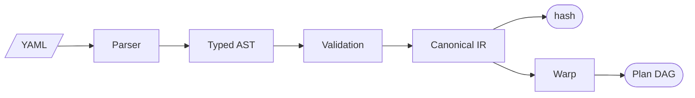

The canonical intermediate representation (IR) serializes deterministically, which gives:

$$
\mathit{CanonID} = H(\mathit{CanonicalEncoding}(\mathit{Canon}))
$$

Content-derived identity borrows the useful part of Nix: identical canonical content produces identical identity. Nomos does not need the Nix store. It needs deterministic identity.

## 7. Cipher

A Cipher is a protected reference whose plaintext is resolved only at the boundary where it is needed.

```yaml
password:
  cipher: vault://production/database/password
```

Cipher is not a synonym for node-specific configuration. Ordinary scoped variables stay ordinary Canon parameters. Secrets need different guarantees.

Cipher plaintext never appears in Plan hashes, Event payloads, Trace output, error messages, debug logs, or telemetry.

```rust
trait CipherProvider {
    async fn resolve(&self, reference: &CipherRef) -> Result<SecretBytes>;
}
```

Candidate providers: a local protected file, an environment-backed development provider, HashiCorp Vault, cloud secret stores, and enterprise systems.

Nomos does not become a secrets database.

## 8. Reconciliation Model

The central abstraction is a level-triggered reconciliation loop. Kubernetes controllers work this way. Nomos adopts the principle without the Kubernetes object model.

For resource $r$:

```text
O_r = observe(r)
V_r = diff(D_r, O_r)
if V_r = ∅: do nothing
else:
  A_r = plan(V_r)
  apply(A_r)
  verify(D_r, O'_r)
```

What actually establishes success? A successful Action means *the intended postcondition was observed*. It does not mean *a command exited with status zero*. Everything else builds on this distinction.

## 9. Substrate Resource Contract

Every managed resource implements roughly:

```rust
trait ResourceDriver {
    type Spec;
    type Observation;
    type Variance;

    async fn observe(&self, spec: &Self::Spec) -> Result<Self::Observation>;
    fn diff(&self, desired: &Self::Spec, observed: &Self::Observation) -> Result<Self::Variance>;
    fn plan(&self, variance: &Self::Variance) -> Result<Vec<Action>>;
    async fn apply(&self, action: &Action) -> Result<ActionEffect>;
    async fn verify(&self, desired: &Self::Spec) -> Result<Verification>;
}
```

Each driver is a black box behind this contract:

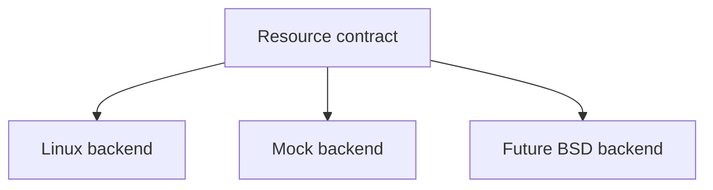

The mock backend is not scaffolding. It is a first-class backend for deterministic reconciliation tests.

## 10. Initial Substrate Resources

Start with `file`, `directory`, `system_user`, `package`, `systemd_unit`, and `sysctl`.

Later: `mount`, `network`, `cgroup`, `kernel_module`, `timer`, `socket`, and container workloads.

Do not start by reproducing Salt's execution-module surface. Prove the resource contract first.

## 11. Atomic Filesystem Operations

`open → truncate → write` can destroy a valid configuration if it fails halfway. File convergence does this instead:


Replacement is a transaction wherever Linux allows it. Observed content is compared by hash before anything reads or ships whole files.

## 12. systemd Integration

systemd is the authoritative service manager on the initial platform. Substrate talks to it over D-Bus (`org.freedesktop.systemd1`) for `GetUnit`, `StartUnit`, `StopUnit`, `RestartUnit`, `ReloadUnit`, unit properties, and job state. It does not scrape `systemctl`.

## 13. cgroup v2

Nomos is cgroup-v2-native. A bounded Action can run as:

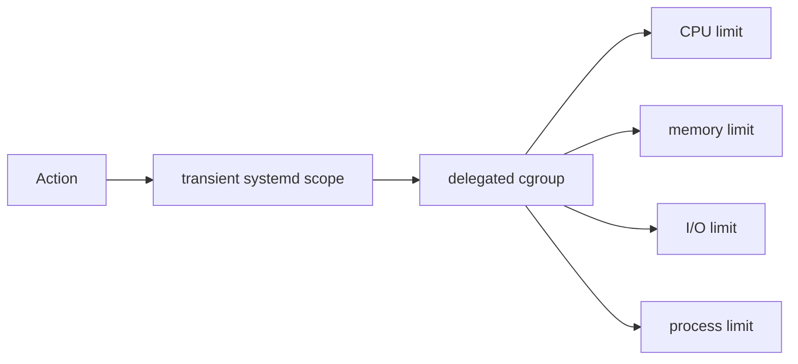

Nomos cooperates with systemd through `Delegate=`. It does not fight PID 1 for the cgroup hierarchy. PID 1 tends to win those fights.

## 14. Warp Graph Model

Warp builds $G = (V, E)$, where $V$ is the set of Actions and $E$ the dependency constraints. The initial edge kinds:

- **`requires`.** B may execute only after A succeeds.
- **`after`.** B is ordered after A. B does not exist because A changed.
- **`on_change`.** B becomes actionable only if A produced a state change.

`watch` stays out of v0 unless it expresses something these three cannot.

## 15. Warp Algorithms

Warp needs surprisingly little machinery.

- **Cycle detection.** `A requires B`, `B requires C`, `C requires A` fails compilation. Use strongly connected components or the graph library's cycle reporting.
- **Topological ordering.** $O(|V| + |E|)$ for a valid DAG.
- **Execution frontier.** $\mathit{Ready} = \{ v \mid \mathit{dependencies}(v) = \mathit{Succeeded} \}$. Everything in Ready may run concurrently, subject to policy.
- **Conflict keys.** Actions can claim exclusive keys such as `package-manager:dpkg`, `file:/etc/hosts`, or `systemd:nginx.service`. Two Actions sharing a key never run at the same time. Independence in the graph is not independence in the operating system.

Details and proofs: [formal/warp.md](formal/warp.md).

## 16. Plan

A Plan is an internal compiled artifact, not another branded term.

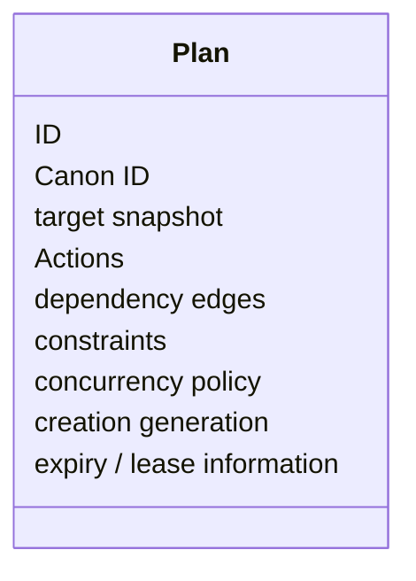

Plan identity derives from canonical content where practical. Plans are immutable after acceptance. Changing a Plan produces a new Plan.

## 17. Optimistic Planning

Nomad separates evaluation, planning, validation, and execution, and rejects plans made stale by concurrent changes. Nomos uses a simpler version.

Loom compiles against a node-state generation, say 417. The Plan carries `expected_generation = 417`. Before execution, the authority checks that the assumption still holds. If reality has moved on, the Plan is rejected, state is observed again, and the Plan is recompiled.

This beats locking the whole fleet while planning.

## 18. Action

An Action is one bounded attempt to cause or verify a state transition.

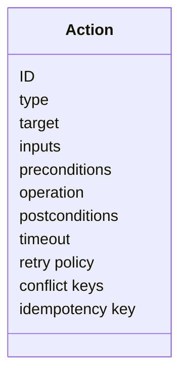

Lifecycle: `Prepared → Dispatched → Accepted → Running → Verifying → Succeeded`. The terminal alternatives are `Failed`, `TimedOut`, `Cancelled`, and `Rejected`.

A timeout is not a failure. The remote operation may have finished after the connection vanished. Nomos records the outcome as uncertain and observes again. It never assumes the operation did not happen.

## 19. Idempotency

Networks are imperfect. The baseline is at-least-once delivery plus idempotent execution.

Each Action carries an idempotency key, and the Cell persists the keys it accepts. When Loom retransmits after losing a response:

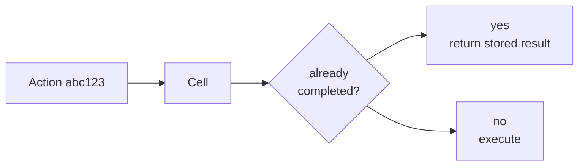

Nomos does not claim magical exactly-once distributed execution. It gives explicit semantics under retries. Details: [formal/fencing-and-idempotency.md](formal/fencing-and-idempotency.md).

## 20. Fencing

Plans carry monotonically increasing generations (fencing tokens). A Cell that has accepted generation 52 rejects generation 51, because $51 < 52$.

This stops stale controllers, delayed packets, and reconnect races from resurrecting obsolete Actions. It matters even more once Loom is highly available.

## 21. Loom Targeting

Fleet selection evaluates predicates over Traits:

```sh
nomos-loom trace \
  --target 'traits.os == "debian" && traits.tier == "edge"' \
  --canon telemetry-stack
```

$$
\mathit{Target} = \{ n \in \mathit{Nodes} \mid \mathit{Predicate}(\mathit{Traits}(n)) \}
$$

For small fleets, scan an in-memory indexed map. At larger scale, common equality predicates can use roaring bitmaps (Trait → value → bitmap of NodeIDs). Add that when measurements demand it, not before.

## 22. Loom Scheduling

Once Warp exposes a frontier, Loom applies operational constraints:

```yaml
execution:
  parallelism: 8
  max_unavailable: 1
  failure_domain:
    trait: rack
    max_unavailable: 1
```

$$
\mathit{Runnable} = \mathit{Ready} \cap \mathit{PolicyAllowed} \cap \mathit{CapacityAvailable}
$$

v0 needs bounded concurrency, dependency readiness, per-node exclusivity, conflict keys, max-unavailable budgets, cancellation, and backpressure.

Weighted fair queuing, work stealing, critical-path prioritization, adaptive concurrency, and topology-aware scheduling are later research.

## 23. Cell Architecture

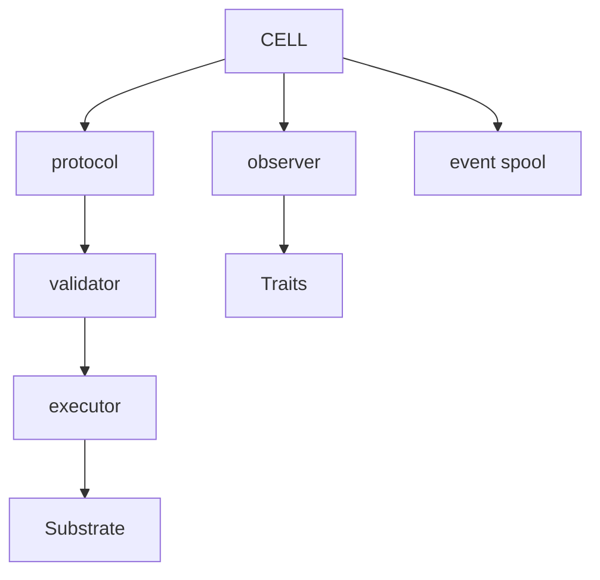

The Cell owns execution semantics. Loom may ask it to converge resource X. The Cell decides whether the local operation actually achieved its postcondition. Operating-system truth stays close to the operating system.

## 24. Cell Offline Behavior

A disconnected Cell may:

- observe state
- run a local Trace
- execute explicitly local Canon
- persist Events
- finish already-authorized, bounded work where policy allows

A disconnected Cell does not accept imaginary new fleet authority. Central Plans carry leases and expiry for exactly this reason.

When connectivity returns:


## 25. Event

Every meaningful control transition emits an Event.

```rust
struct Event {
    id: EventId,
    writer: WriterId,
    writer_sequence: u64,

    node_id: Option<NodeId>,
    canon_id: Option<CanonId>,
    plan_id: Option<PlanId>,
    action_id: Option<ActionId>,

    kind: EventKind,

    occurred_at: Timestamp,
    causation_id: Option<EventId>,
    correlation_id: Option<CorrelationId>,

    payload: EventPayload,
}
```

Events are immutable after append.

## 26. Event Log

Event Log is the canonical term. Not Journal. Not Ledger.

The Event Log is an append-only sequence of immutable operational Events. It supports recovery, audit, materialized fleet state, debugging, Plan history, and external integration.

Conceptually, $\mathit{State}_t = \mathrm{fold}(\mathit{Event}_0, \ldots, \mathit{Event}_t)$. In practice, implementations keep materialized state so that queries do not replay all of history.

## 27. Event Ordering

Wall-clock timestamps do not establish causality.

Each writer maintains a `writer_sequence`, which orders its own Events strictly. Loom assigns its own ingestion position on receipt. Causality across nodes is explicit, through `causation_id`, `correlation_id`, `plan_id`, and `action_id`. `timestamp(A) < timestamp(B)` does not imply that A caused B.

Hybrid logical clocks are a reasonable later candidate. Vector clocks need a concrete requirement first, because fleet-wide vector metadata scales poorly.

## 28. Event Log Integrity

Append-only is not the same as tamper-proof. v0 guarantees:

- no supported update operation
- no supported in-place mutation
- a monotonic writer sequence
- transactional append

A later integrity mode can add a hash chain, $H_n = H(H_{n-1} \Vert \mathit{Event}_n)$, followed by signed checkpoints or Merkle structures. Only then does "Ledger" become a defensible word.

## 29. Persistence

The storage API stays abstract. What does the engine actually have to do? Append durably, look records up by key, and survive a crash mid-transaction. `redb`, a pure-Rust embedded ACID key-value store built on copy-on-write B-trees, does all three and is a strong v0 candidate. That is a hypothesis for the ablation to test, not a verdict.

Possible layout: `events`, `event_by_id`, `actions`, `action_idempotency`, `traits`, `materialized_nodes`, `plans`, `canons`, `metadata`.

Before the choice is frozen, an ablation compares redb, SQLite, and an LMDB-family option on append throughput, crash recovery, fsync behavior, query ergonomics, binary size, dependency burden, corruption recovery, and operational transparency.

## 30. Control Protocol

Protocol and transport are separate abstractions. The starting point is a Protocol Buffers schema, a tonic-compatible service model, and HTTP/2 with TLS.

The Cell initiates the connection to Loom. That works through NAT, host firewalls, cloud networks, and enterprise networks without exposing a management port on every host.

The stream carries registration, Traits, heartbeats, Plan assignments, Action status, Events, and acknowledgements. QUIC or another transport can be added later without touching the domain schema.

## 31. Backpressure

Loom never produces work at a higher rate than Cells can safely consume it.

Each Cell advertises its capacity, for example `max_parallel_actions = 4` and `queue_capacity = 32`. Loom keeps bounded queues. When capacity runs out, the producer slows down. Memory usage does not approach infinity.

Bounded channels and explicit admission control are standard everywhere. Tokio cancellation is cooperative, and dropping a future does not reverse side effects. That is one more reason for an explicit Action lifecycle and explicit timeouts.

## 32. Identity

Nomos uses `NodeID`, `CanonID`, `PlanID`, `ActionID`, and `EventID`. Identity is fundamental, but it does not need another themed noun.

Cell identity will be cryptographically verifiable. Nomos borrows SPIFFE's principles (workload identity, trust domains, short-lived certificates, mutual authentication, automatic rotation) without requiring a SPIRE deployment. SPIFFE compatibility can come later as an integration.

## 33. Security Boundary

A Cell can change `/etc`, packages, services, users, and kernel parameters. That makes it a remote root-management system. Pretending otherwise only gives root access nicer branding.

The Cell is therefore privilege-separated:

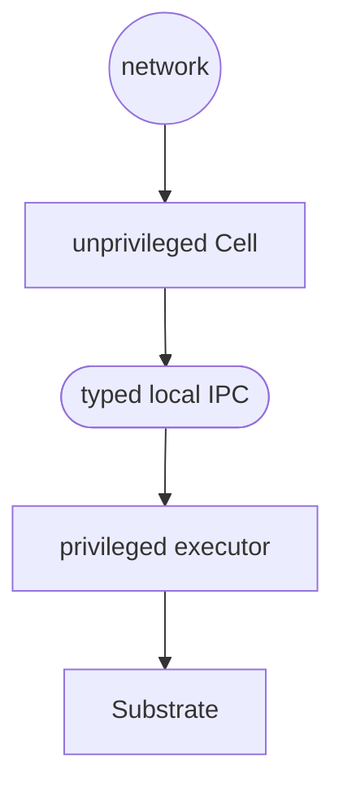

The privileged side accepts typed operations only, never serialized shell commands. The two halves talk over local inter-process communication (IPC): a root-owned Unix-domain socket, with the kernel's peer credentials (`SO_PEERCRED`) identifying the caller. Parsing, networking, and protocol complexity stay out of the most privileged process.

## 34. Shell Escape Hatch

Arbitrary shell execution is not a reconciliation primitive. If it is ever added, it is explicitly opaque:

```yaml
kind: exec
spec:
  command: ...
  precondition: ...
  postcondition: ...
```

Policy can forbid it entirely. Arbitrary commands make idempotence, expected mutation, authorization scope, rollback, affected resources, verification, and permissions much harder to reason about. Typed operations come first.

## 35. Linux Hardening

Nomos services use systemd hardening where their responsibilities allow: `NoNewPrivileges`, `ProtectSystem`, `ProtectHome`, `PrivateTmp`, `RestrictSUIDSGID`, capability bounding, seccomp, cgroup limits, and resource controls.

Loom can be hardened aggressively. The Cell's privilege boundaries must match the mutations it actually performs, and the privileged helper needs the most carefully tailored policy of all.

## 36. Polkit

Polkit is not the foundation of network authorization. It may help a local human run a privileged operation through the CLI. Loom-to-Cell authorization belongs to Nomos's authenticated protocol and policy model.

## 37. Trace

Trace guarantees non-mutation.

```sh
nomos-cell trace --canon system.yaml
```

```text
FILE /etc/example.conf
  content:
    observed: sha256:abc
    desired:  sha256:def
    action: replace

SYSTEMD example.service
  enabled:
    observed: false
    desired:  true
  state:
    observed: stopped
    desired:  running
```

Trace uses exactly the same parse, observe, diff, and compile pipeline as Enforce. Only execution is left out. A dry run that secretly takes a different code path is a lie with good manners.

## 38. Enforce

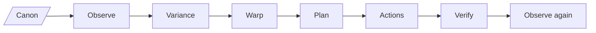

Convergence ends when $\mathit{Variance} = \varnothing$ or a defined failure condition is reached.

Reconciliation loops are bounded. If A changes X and B changes it back, over and over, Nomos detects the non-convergence. It does not cheerfully consume electricity forever.

## 39. Fixed-Point Property

If $\mathrm{Enforce}(\mathit{Canon}, S) = S'$ and $\mathit{Variance}(\mathit{Canon}, S') = \varnothing$, then $\mathrm{Enforce}(\mathit{Canon}, S') = S'$.

The second application performs no mutating Actions. This is one of Nomos's most important property-based tests.

## 40. Failure Semantics

Nomos treats all of these as normal operating conditions, not exotic theory:

- process and host crashes
- network partitions
- message duplication, loss, and delay
- partial execution
- Loom and Cell restarts
- clock skew
- stale Plans

Every outcome must be representable.

## 41. Availability Model

Version 0 runs one Loom and many Cells.

What fails if the coordinator disappears? New fleet decisions. Nothing a Cell has already observed or been authorized to do. Cell state is not corrupted, and Cells stay locally inspectable. That is intentional. Do not add consensus merely because Nomos involves more than one computer.

## 42. Future Loom High Availability

Is that actually consensus, or coordination wearing a consensus hat? Single-writer metadata with failover is a narrower problem than replicated state-machine consensus. Consensus becomes necessary once multiple replicas must agree on an ordered sequence of state changes despite failures. If real requirements get there, Raft fits Canon registrations, Plan generations, ownership and leases, and critical control metadata. OpenRaft is a current Rust implementation.

Consensus does not replicate Trait samples, debug logs, metrics, or high-volume telemetry just because a consensus engine is available. Not everything deserves a quorum.

## 43. Consistency Under Partition (CAP)

Nomos does not solve the consistency, availability, and partition-tolerance trade-off. It chooses consistency semantics per subsystem.

During a partition, authoritative Loom state prefers refusing conflicting control decisions to letting multiple authorities mutate the same fleet. That part leans toward consistency.

Cells keep local availability for observation, Trace, cached state, and explicitly authorized local convergence. The system does not need one universal CAP choice.

## 44. Event Log vs. Telemetry

Nomos Events are control-plane records, not an observability pipeline. CPU samples, log lines, packets, and metrics do not belong in the authoritative Event Log.

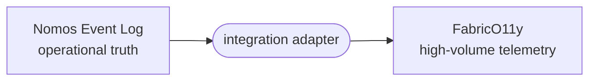

The adapter exports Events such as Action started, Action completed, Canon changed, Variance detected, Cell disconnected, Plan rejected, and convergence failed. FabricO11y observes systems. Nomos controls them. Their storage architectures stay independent.

## 45. Testing Architecture

Nomos is built for aggressive testing from day one.

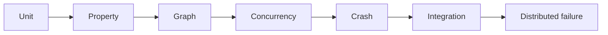

## 46. Property-Based Testing

- **Idempotence.** $\mathrm{enforce}(\mathrm{enforce}(S)) = \mathrm{enforce}(S)$.
- **Trace purity.** $\mathit{SubstrateBefore} = \mathit{SubstrateAfter}$ for every Trace.
- **Graph validity.** Every dependency precedes its dependent Action.
- **Determinism.** Identical Canon, Traits, and observed state produce identical logical Plans.
- **Secret non-disclosure.** No Cipher plaintext appears in serialized Events.
- **Event monotonicity.** For every writer, $\mathit{sequence}_{n+1} > \mathit{sequence}_n$.
- **Stale fencing.** An Action with a generation below the latest accepted generation never executes.

## 47. Concurrency Testing

There is a wonderfully inconvenient naming collision here. Rust already has a crate called `loom`. It systematically explores thread interleavings to expose concurrency bugs, instead of hoping random tests eventually hit them.

That is exactly what Nomos needs. The component keeps the name `nomos-loom`, and the test dependency is aliased:

```toml
loom-model = { package = "loom", version = "..." }
```

Queues, leases, and state transitions then get deterministic concurrency tests. The universe has apparently decided to participate in the naming scheme.

## 48. Formal Specification

Nomos keeps a small TLA+ model next to the implementation in `formal/tla/`. It models the control protocol, not Linux.

State variables: `plans`, `actions`, `nodes`, `accepted_generation`, `action_state`, `event_sequence`, `leases`.

Initial invariants:

- **Dependency safety.** $\mathrm{Running}(a) \Rightarrow \forall d \in \mathrm{Requires}(a) : \mathrm{Succeeded}(d)$.
- **Fencing safety.** $\mathrm{Execute}(a) \Rightarrow \mathrm{Generation}(a) \ge \mathrm{AcceptedGeneration}(\mathit{node})$.
- **Verified success.** No Action becomes `Succeeded` without successful verification.
- **Single active authority.** A node never accepts conflicting Plan generations at the same time.
- **Bounded disruption.** For policy $k$, $\mathrm{Unavailable}(\mathit{FailureDomain}) \le k$.
- **Event monotonicity.** Each writer sequence strictly increases.

TLA+ finds illegal interleavings before they become Rust integration tests. Written statements and proof sketches live in [formal/](formal/).

## 49. Crash Testing

Every persistent transition gets killed on purpose:

- the Cell after accepting an Action
- the Cell during an operation
- the Cell after an operation, before the Event append
- the Cell after the Event append, before acknowledgement
- Loom after dispatch
- Loom after receiving a result, before persistence

Recovery must be deterministic. This is how the Event Log earns its existence instead of becoming architectural decoration.

## 50. Workspace

The workspace follows a hexagonal layout. See [architecture/hexagon.md](architecture/hexagon.md) and architecture decision record (ADR) [0000](adr/0000-foundations.md).

Crates beyond the four components (`nomos-canon`, `nomos-store`, `nomos-protocol`, and the port and adapter crates) are implementation boundaries, not user-facing concepts.

## 51. CLI

Loom:

```sh
nomos-loom compile --canon base-system.yaml
nomos-loom trace   --target 'traits.os == "debian"' --canon hardened-host.yaml
nomos-loom enforce --target 'traits.tier == "edge"' --canon telemetry-stack.yaml
```

| Command | Effect |
| --- | --- |
| `compile` | Compile and validate Canon |
| `trace` | Distributed, non-mutating evaluation |
| `enforce` | Coordinate fleet convergence |

Cell:

```sh
nomos-cell traits
nomos-cell trace   --canon /etc/nomos/local.yaml
nomos-cell enforce --canon /etc/nomos/local.yaml
nomos-cell events
```

| Command | Effect |
| --- | --- |
| `traits` | Show local Traits |
| `trace` | Evaluate local Variance |
| `enforce` | Standalone convergence |
| `events` | Inspect the local Event Log |

## 52. Design Lineage

Nomos inherits principles, not products.

| System or concept | Lesson Nomos takes |
| --- | --- |
| Salt | Broad host-state management, remote execution, targeting |
| Kubernetes | Level-triggered reconciliation and independently understandable controllers |
| Nomad | Desired vs. emergent state, optimistic planning, validation before commitment |
| Nix | Deterministic declarative inputs and content-derived identity |
| Temporal | Durable execution state and explicit recovery after failures |
| systemd | Typed native service control, cgroup ownership, Linux-native resource lifecycle |
| SPIFFE | Workload identity and short-lived cryptographic credentials |
| Raft | Consensus only for genuinely replicated authoritative state |
| Event sourcing | Immutable transitions plus derived materialized state |
| TLA+ | Control-protocol safety verified independently of the implementation |
| Rust `loom` | Systematic exploration of concurrency interleavings |

Nomos takes these properties selectively. It does not absorb their architectures.

## 53. Explicit Non-Goals for v0

Nomos v0 is not:

- a Kubernetes replacement
- a container orchestrator
- a secrets manager
- a telemetry database
- a service mesh
- a package ecosystem
- a distributed filesystem
- a general workflow engine
- a shell-command broadcasting tool
- a multi-region consensus platform
- a new Linux init system
- a universal cross-platform abstraction

The reference problem is simpler: *reliably describe, inspect, change, and verify Linux host state, locally and across a fleet.* That problem is hard enough without trying to colonize computing.

## 54. Initial Research Ablations

Uncertain choices are settled by experiment before they are frozen.

- **Persistence.** redb vs. SQLite vs. an LMDB-family store.
- **Canon syntax.** Strict YAML vs. TOML, with the same typed IR either way.
- **Transport.** Validate tonic over HTTP/2 against requirements before looking at QUIC.
- **File observation.** Metadata plus hash vs. full read vs. notification-assisted caching.
- **Fleet targeting.** Predicate scans vs. bitmap indexes, at large synthetic fleet sizes only.
- **Reconciliation scheduling.** Sequential vs. bounded DAG parallelism vs. conflict-aware DAG parallelism.

Do not pick sophisticated algorithms because their papers have attractive diagrams.

## 55. Development Phases

- **Phase 0: Semantics.** No networking. Build `nomos-core`, `nomos-canon`, `nomos-substrate-mock`, and `nomos-warp`. Prove that Canon → Observation → Variance → Plan is deterministic.
- **Phase 1: Masterless Cell.** Add the Linux Substrate, Debian first, with `file`, `directory`, `system_user`, `systemd_unit`, `sysctl`, and `package`, and the commands `traits`, `trace`, and `enforce`. Done when a Debian machine converges locally from any supported starting state.
- **Phase 2: Event Log and recovery.** Make every Action transition durable. Kill the Cell at every lifecycle boundary and prove deterministic recovery.
- **Phase 3: Loom.** Introduce one coordinator with Cell registration, Traits, targeting, Plan dispatch, Action results, and Event ingestion. No consensus.
- **Phase 4: Fleet safety.** Bounded parallelism, max-unavailable, failure domains, fencing, leases, backpressure, and stale-Plan rejection. This is where Nomos becomes genuinely useful for production maintenance.
- **Phase 5: Privilege separation.** Split network-facing Cell logic from a minimal privileged executor, with local IPC, peer authentication, a typed privileged API, systemd hardening, and seccomp where practical.
- **Phase 6: External integrations.** Cipher providers, FabricO11y, CI/CD, change management, and identity providers, all as adapters outside the core model.
- **Phase 7: High availability.** Only if real operating goals require it: multiple Loom replicas, leader election, and replicated authoritative state. Evaluate OpenRaft and alternatives then.

Consensus is an extension of the architecture, not a prerequisite for compiling a file manifest.

## 56. First End-to-End Demonstration

The first serious demonstration manages a sibling project: Nomos deploys the FabricO11y agent onto Debian hosts. The Canon covers a system user, directories, the binary artifact, configuration, the systemd service, resource limits, service enablement, and service health.

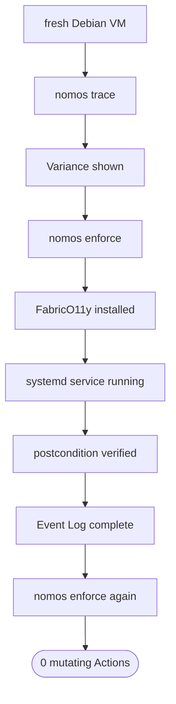

Then break the host on purpose: delete the config, stop the service, change permissions, and alter a sysctl. Trace must identify the exact Variance. Enforce must restore the Canon.

## 57. Failure Demonstration

The second demonstration is deliberately hostile to Nomos itself. During convergence:

- kill the Cell
- restart the Cell
- disconnect the network
- deliver a Plan twice
- delay an old Action
- restart Loom

Expected outcome:

- no duplicate destructive mutation
- no stale Action execution
- no false success
- no corrupted Event Log
- eventual convergence after recovery

This proves more than a benchmark of 40,000 meaningless no-op commands per second.

## 58. Core Safety Invariants

The constitutional layer.

- **N1.** Trace does not mutate Substrate.
- **N2.** Successful Enforce converges supported resources toward Canon.
- **N3.** Re-enforcing converged Canon performs no required mutation.
- **N4.** No Action executes before its hard dependencies succeed.
- **N5.** A stale, fenced Plan cannot execute.
- **N6.** `Succeeded` requires verified postconditions.
- **N7.** Events are never mutated after append.
- **N8.** Cipher plaintext never enters persistent operational records.
- **N9.** Failure-budget constraints are never intentionally exceeded.
- **N10.** An unknown execution outcome stays unknown. It is never silently converted to success or failure.
- **N11.** Losing Loom does not invalidate already-observed Cell state.
- **N12.** Canon compilation is deterministic for identical inputs.

These invariants matter more than any implementation technology. Formal statements: [formal/invariants.md](formal/invariants.md).

## 59. Architectural Thesis

Nomos is five transformations. Canon, Traits, and Observation produce Variance. Variance produces a Warp graph. Warp produces Actions. Actions operate through Substrate. Every meaningful transition produces Events.

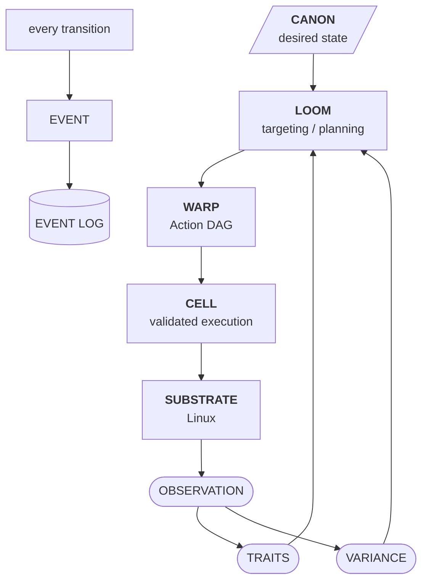

The governing idea fits in one sentence:

> Observe reality, compare it with Canon, derive the smallest valid change, apply that change under explicit safety constraints, verify reality again, and preserve what happened as immutable history.

Everything else is machinery in service of that loop.

## 60. Relationship to Moiric

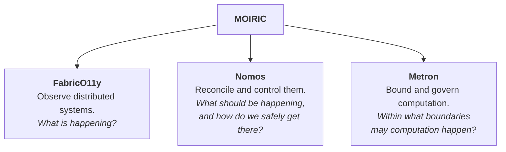

The three stay independently useful, with narrow integration surfaces. They do not slowly merge into one enormous platform. That separation is architecture, not branding.

## 61. Definition of v0 Success

Nomos v0 succeeds when it demonstrates all of the following on real Debian hosts:

1. Parse and deterministically compile Canon.
2. Discover and expose typed Traits.
3. Observe supported Linux resources without mutation.
4. Compute precise Variance.
5. Compile valid Action DAGs and reject cycles.
6. Produce a trustworthy Trace.
7. Enforce Canon locally through the Cell.
8. Verify every successful state transition.
9. Produce no mutating Actions after convergence.
10. Persist an append-only Event Log.
11. Recover coherently after Cell termination.
12. Connect Cells to a single Loom.
13. Select fleets with Trait predicates.
14. Dispatch and deduplicate Actions reliably.
15. Reject stale Plans with fencing.
16. Enforce concurrency and disruption budgets.
17. Recover from temporary network disconnection.
18. Keep Cipher plaintext out of persistent records.
19. Export operational Events to FabricO11y.
20. Demonstrate the key protocol invariants through model, property, and failure testing.

Anything beyond this is subsequent architecture. Nomos earns its complexity one invariant at a time.

## 62. Open Questions

The unresolved parts, stated so they can be argued with:

- **Edge semantics.** Does `after` wait for any terminal outcome, and does `on_change` imply ordering? [formal/warp.md](formal/warp.md) has working definitions. They need an ADR.
- **Idempotency key retention.** The Cell persists accepted keys. For how long? Unbounded retention is a slow disk leak. Bounded retention reopens the duplicate window for very late retransmissions.
- **Leases vs. clock skew.** Plan leases expire in time, and clocks drift. Does expiry use Loom's clock, the Cell's clock, or a monotonic budget measured from receipt?
- **Secrets during Trace.** Some observations may need a Cipher, for example comparing the hash of a rendered file that contains a password. Does Trace resolve secrets, or does it report that Variance as unknown?
- **Mesh identity vs. Nomos identity.** Headscale authenticates nodes on the network. Nomos authorizes Cells to act. How are the two bound, so a compromised tailnet key does not become fleet authority?
- **Persistence.** redb, SQLite, or an LMDB-family store. The ablation in §54 decides.
