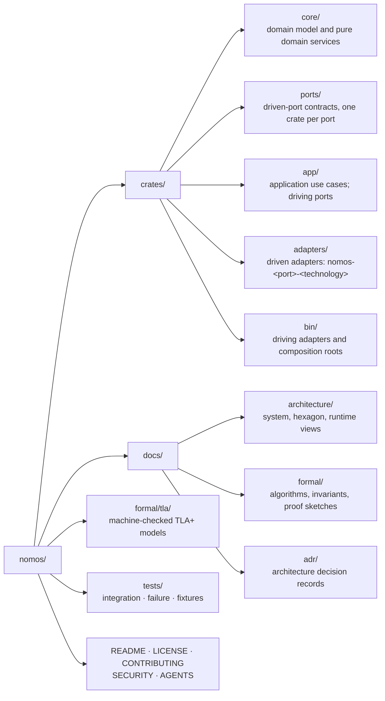

# ADR 0000: Foundations: hexagonal layout and pinned toolchain

- Status: Accepted
- Date: 2026-09-27

## Context

Nomos must run the same reconciliation logic against real Linux, a
deterministic mock, and future backends. It must also integrate external
systems (secret stores, network control planes, storage engines, transports)
without pulling those products into its core model (spec §9, §55 Phase 6,
§53). Its central guarantees are determinism (N12) and reproducible
behaviour under test. Those guarantees include the toolchain that builds it.

## Decision

### 1. Hexagonal (ports and adapters) architecture

The domain sits at the centre. Everything external is reached through a port
and implemented by an adapter.

### 2. Directory layout mirrors the hexagon

A crate's layer can be read from its path. A new crate belongs in exactly one
of these directories.

### 3. Dependency rule (inward only)

1. `core/nomos-core` depends on no workspace crate.
2. Other `core/` crates depend only on `core/` crates.
3. `ports/` crates depend only on `core/`.
4. `app/` depends on `core/` and `ports/`, never on `adapters/`.
5. An `adapters/` crate depends on `core/` and exactly the one port it implements.
6. Only `bin/` crates depend on `adapters/`. They are the only place where adapters are wired to ports.

The workspace `Cargo.toml` manifests enforce these edges at build time.

### 4. Rust toolchain pinned to 1.98.1

- `rust-toolchain.toml` pins `channel = "1.98.1"` with `rustfmt` and `clippy`.
- The workspace declares `rust-version = "1.98.1"`.
- CI installs the same version explicitly.
- Edition 2024.

The toolchain is upgraded deliberately, by one change that updates all three
places and records the reason. Pinning keeps `clippy -D warnings` and
formatting stable. It also stops a new compiler release from silently changing
the build.

## Consequences

- Trace/Enforce and the property tests can run against
  `nomos-substrate-mock` with no OS access.
- Replacing a technology (Vault, Headscale, a storage engine, a transport) is
  local to one adapter crate.
- There are more crates than a flat layout would need. We accept that cost
  in exchange for boundaries the compiler enforces.
- Contributors need rustup; the pinned toolchain installs automatically.
