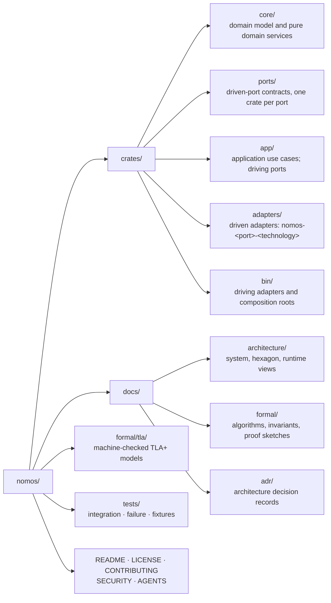

# ADR 0000: Foundations, hexagonal layout, and pinned toolchain

- **Status.** Accepted
- **Date.** 2026-09-27

## Context

Nomos must run the same reconciliation logic against real Linux, a deterministic mock, and backends nobody has written yet. It must integrate secret stores, network control planes, storage engines, and transports without dragging those products into its core model (spec §9, §53, and §55 Phase 6).

Its central promises are determinism (N12) and reproducible behavior under test. The toolchain that builds it is part of that promise.

## Decision

### 1. Hexagonal architecture

The domain sits at the center. Everything external is reached through a port and implemented by an adapter.

### 2. The directory layout mirrors the hexagon

A crate's layer is visible from its path. Every new crate belongs in exactly one of these directories.

### 3. Dependencies point inward

1. `core/nomos-core` depends on no workspace crate.
2. Other `core/` crates depend only on `core/` crates.
3. `ports/` crates depend only on `core/`.
4. `app/` depends on `core/` and `ports/`, never on `adapters/`.
5. An `adapters/` crate depends on `core/` and on exactly the one port it implements.
6. Only `bin/` crates depend on `adapters/`. They are the only place adapters are wired to ports.

The `Cargo.toml` manifests encode these edges, so the build enforces them.

### 4. Rust is pinned to 1.98.1

- `rust-toolchain.toml` pins `channel = "1.98.1"` with `rustfmt` and `clippy`.
- The workspace declares `rust-version = "1.98.1"`.
- CI installs the same version explicitly.
- The edition is 2024.

Upgrades are deliberate: one change updates all three places and records why. A pinned toolchain keeps `clippy -D warnings` and formatting stable, and a new compiler release cannot quietly change the build.

## Consequences

- Trace, Enforce, and the property tests run against `nomos-substrate-mock` with no OS access.
- Replacing a technology (Vault, Headscale, a storage engine, a transport) touches one adapter crate.
- There are more crates than a flat layout would need. That is the price of boundaries the compiler enforces, and it is worth paying.
- Contributors need rustup. The pinned toolchain then installs itself.
