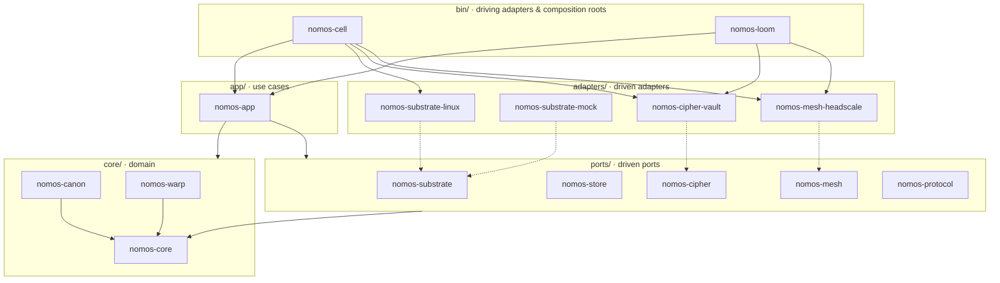

# Hexagon: ports and adapters

Nomos is a hexagonal (ports and adapters) Rust workspace. The domain sits at
the centre. It knows nothing about Linux, Vault, Headscale, storage engines or
transports.

Arrows are Cargo dependencies. Dotted arrows are "implements". Every arrow
points toward the domain.

## Layout

| Layer | Path | Crates |
|---|---|---|
| Domain | `crates/core/` | `nomos-core`, `nomos-canon`, `nomos-warp` |
| Ports (driven) | `crates/ports/` | `nomos-substrate`, `nomos-store`, `nomos-cipher`, `nomos-mesh`, `nomos-protocol` |
| Application | `crates/app/` | `nomos-app` |
| Adapters (driven) | `crates/adapters/` | `nomos-substrate-linux`, `nomos-substrate-mock`, `nomos-cipher-vault`, `nomos-mesh-headscale` |
| Driving adapters / composition roots | `crates/bin/` | `nomos-cell`, `nomos-loom` |

## Dependency rule

Decided in [ADR 0000](../adr/0000-foundations.md).

Dependencies point inward only.

1. `nomos-core` depends on no workspace crate.
2. Domain services (`nomos-canon`, `nomos-warp`) depend only on `nomos-core`.
3. Port crates depend only on `nomos-core`.
4. `nomos-app` depends on the domain and the ports, **never on adapters**.
5. An adapter depends on `nomos-core` and on **exactly the one port** it implements.
6. Only the binaries (`crates/bin/`) depend on adapters. They are the only place where concrete adapters are wired to ports.

## Ports and their adapters

| Port | Concept | Adapters |
|---|---|---|
| `nomos-substrate` | Operating-system resource contract | `linux` (Debian reference), `mock` (deterministic, first-class) |
| `nomos-cipher` | Cipher: secret-reference resolution | `vault` (HashiCorp Vault) |
| `nomos-mesh` | Control-network enrollment, identity, reachability | `headscale` |
| `nomos-store` | Event Log and materialized state | none yet, pending the persistence ablation |
| `nomos-protocol` | Loom/Cell control protocol | none yet (gRPC candidate) |

Adapter crate naming: `nomos-<port>-<technology>`.
