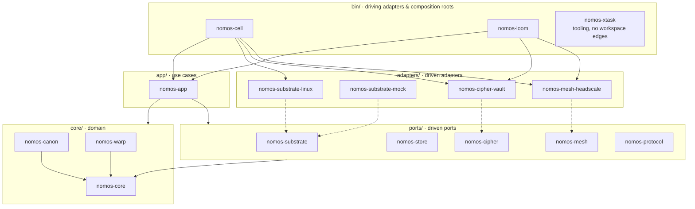

# Hexagon: Ports and Adapters

Nomos is a hexagonal Rust workspace. The domain sits at the center and knows nothing about Linux, Vault, Headscale, storage engines, or transports. It just knows what a Canon is and what convergence means.

Solid arrows are Cargo dependencies. Dotted arrows mean "implements". Every arrow points toward the domain.

## Layout

| Layer | Path | Crates |
| --- | --- | --- |
| Domain | `crates/core/` | `nomos-core`, `nomos-canon`, `nomos-warp` |
| Driven ports | `crates/ports/` | `nomos-substrate`, `nomos-store`, `nomos-cipher`, `nomos-mesh`, `nomos-protocol` |
| Application | `crates/app/` | `nomos-app` |
| Driven adapters | `crates/adapters/` | `nomos-substrate-linux`, `nomos-substrate-mock`, `nomos-cipher-vault`, `nomos-mesh-headscale` |
| Driving adapters and composition roots | `crates/bin/` | `nomos-cell`, `nomos-loom`, and the tooling crate `nomos-xtask` ([ADR 0003](../adr/0003-xtask-tooling-crate.md)) |

## Dependency Rule

Dependencies point inward. [ADR 0000](../adr/0000-foundations.md) records the decision.

1. `nomos-core` depends on no workspace crate.
2. Domain services (`nomos-canon`, `nomos-warp`) depend only on `nomos-core`.
3. Port crates depend only on `nomos-core`.
4. `nomos-app` depends on the domain and the ports, **never on adapters**.
5. An adapter depends on `nomos-core` and on **exactly one port**, the one it implements.
6. Only the binaries in `crates/bin/` depend on adapters. They are the only place concrete adapters meet ports.
7. `nomos-xtask` depends on no workspace crate and nothing depends on it. It is invoked as `cargo xtask` and never linked.

## Ports and Their Adapters

| Port | Concept | Adapters |
| --- | --- | --- |
| `nomos-substrate` | Operating-system resource contract | `linux` (Debian reference), `mock` (deterministic, first-class) |
| `nomos-cipher` | Secret-reference resolution | `vault` (HashiCorp Vault) |
| `nomos-mesh` | Control-network enrollment, identity, and reachability | `headscale` |
| `nomos-store` | Event Log and materialized state | None yet; waiting on the persistence ablation |
| `nomos-protocol` | Loom ↔ Cell control protocol | None yet; gRPC is the candidate |

Adapter crates are named `nomos-<port>-<technology>`.
