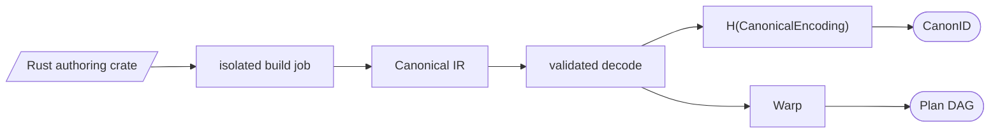
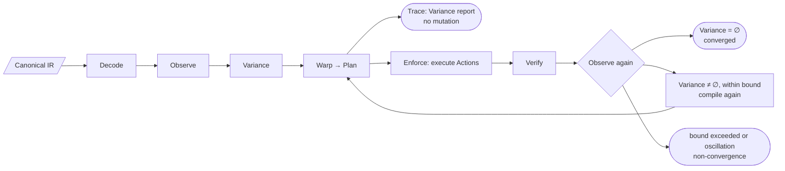
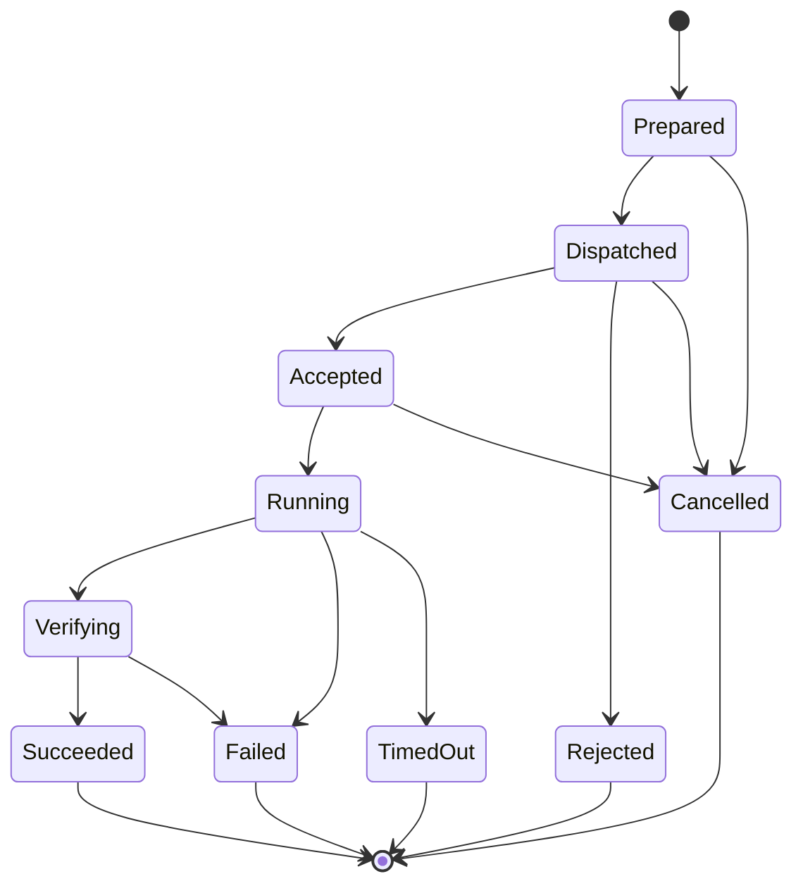
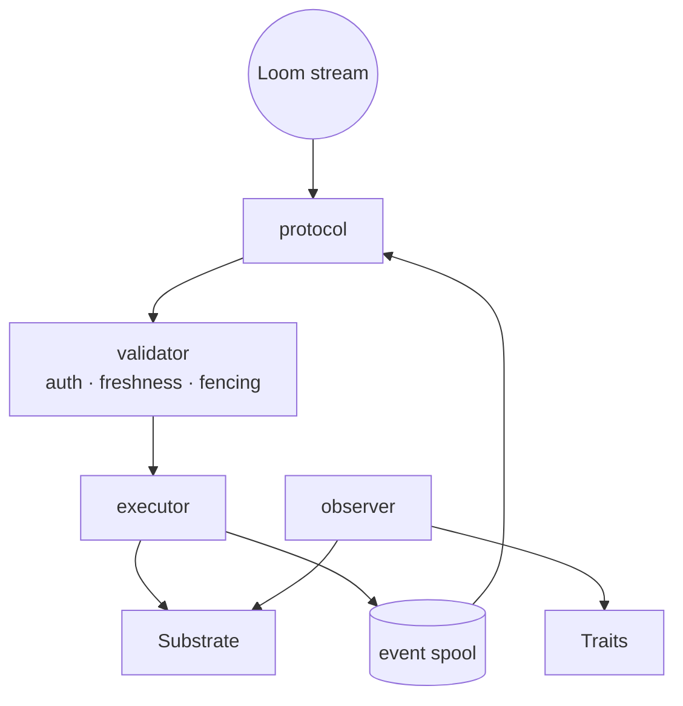
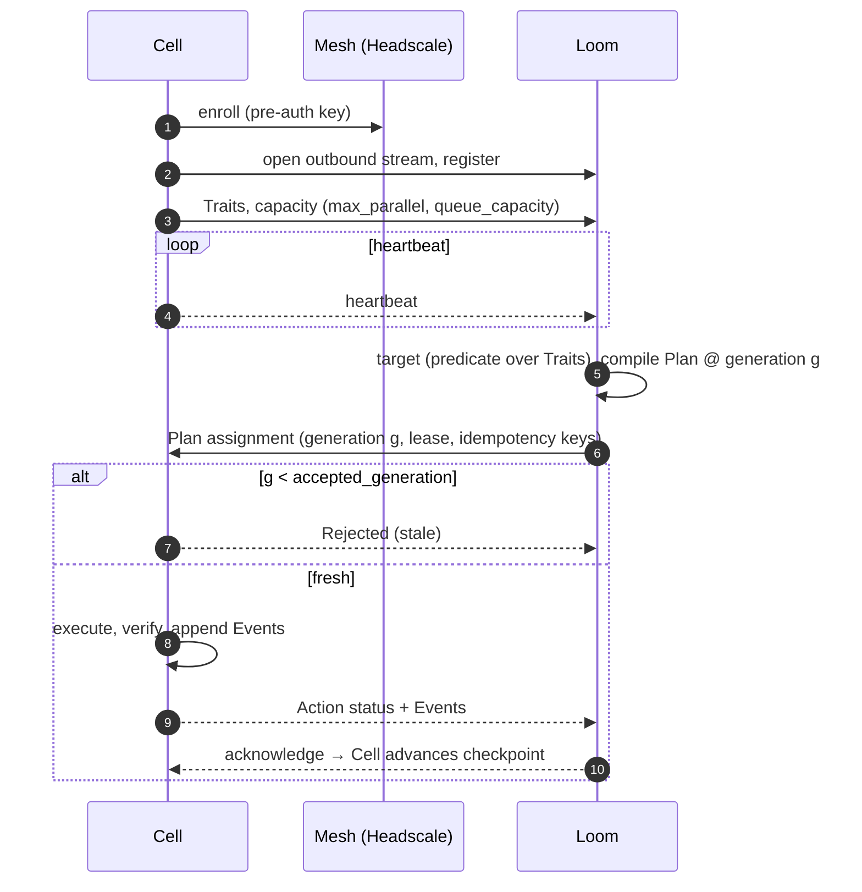
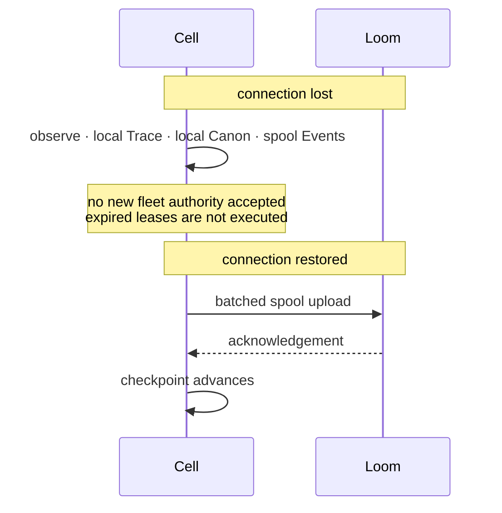
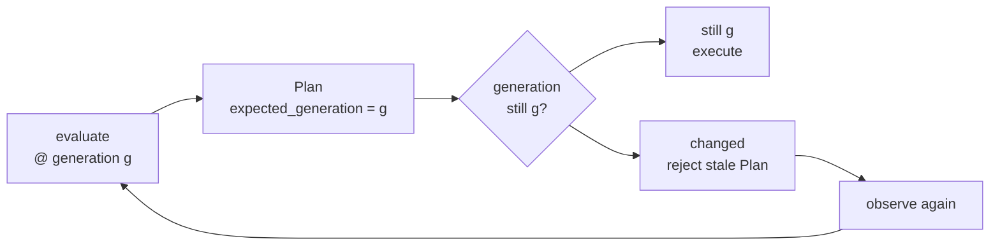

# Runtime

## Canon Compilation

The author's Rust is never executed on a host (spec §5–§6, [ADR 0004](../adr/0004-rust-typed-canon.md)). An authoring crate runs once in an isolated build job and emits the Canonical IR. Loom and Cell accept only the IR.

The canonical IR serializes deterministically, so identical Canon always gets the same `CanonID`. That is invariant N12; see [formal/invariants.md](../formal/invariants.md). Reproducibility of the build job that produces the IR is a separate obligation, tested by the `build-hermeticity` grounding experiment.

## Trace and Enforce Share One Pipeline

Trace is Enforce with the execution stage removed. There is no separate dry-run implementation to drift out of sync (spec §37).

## Action Lifecycle

| Transition | Condition |
| --- | --- |
| `Dispatched → Rejected` | Stale generation, or unauthorized |
| `Verifying → Succeeded` | Postcondition observed |
| `Verifying → Failed` | Postcondition not observed |
| `TimedOut → end` | Outcome unknown; state is observed again |

`TimedOut` does not mean the Action failed. The remote side may have finished the work after the connection dropped. The outcome is recorded as unknown and settled by observing again (invariant N10).

## Cell Internals

Privilege separation is planned for Phase 5 (spec §33):

## Loom ↔ Cell

### Disconnection and Recovery

## Optimistic Planning

Loom plans against a generation and checks it before executing, instead of locking the fleet while it thinks (spec §17).

