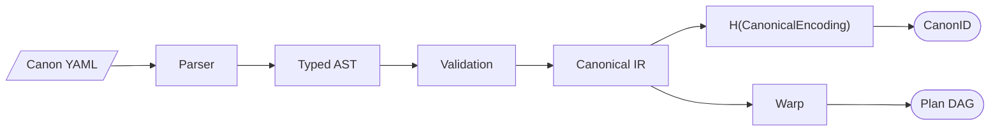
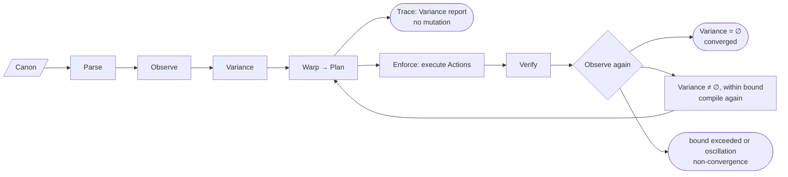
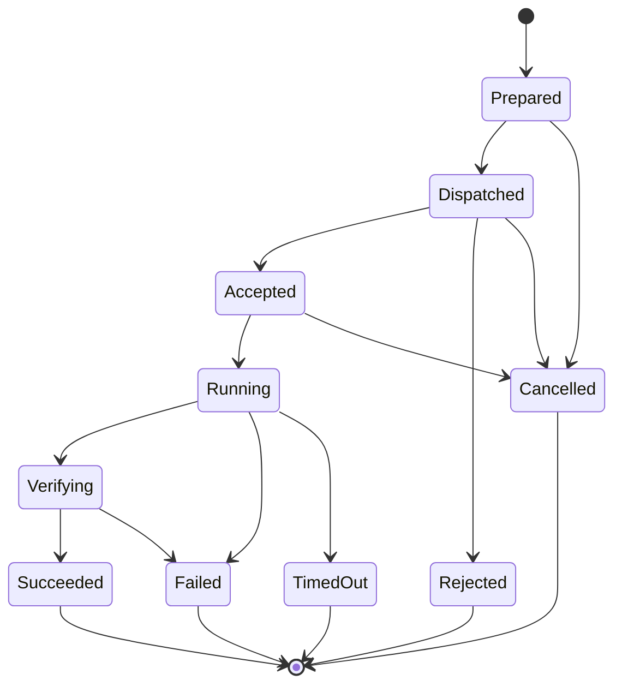
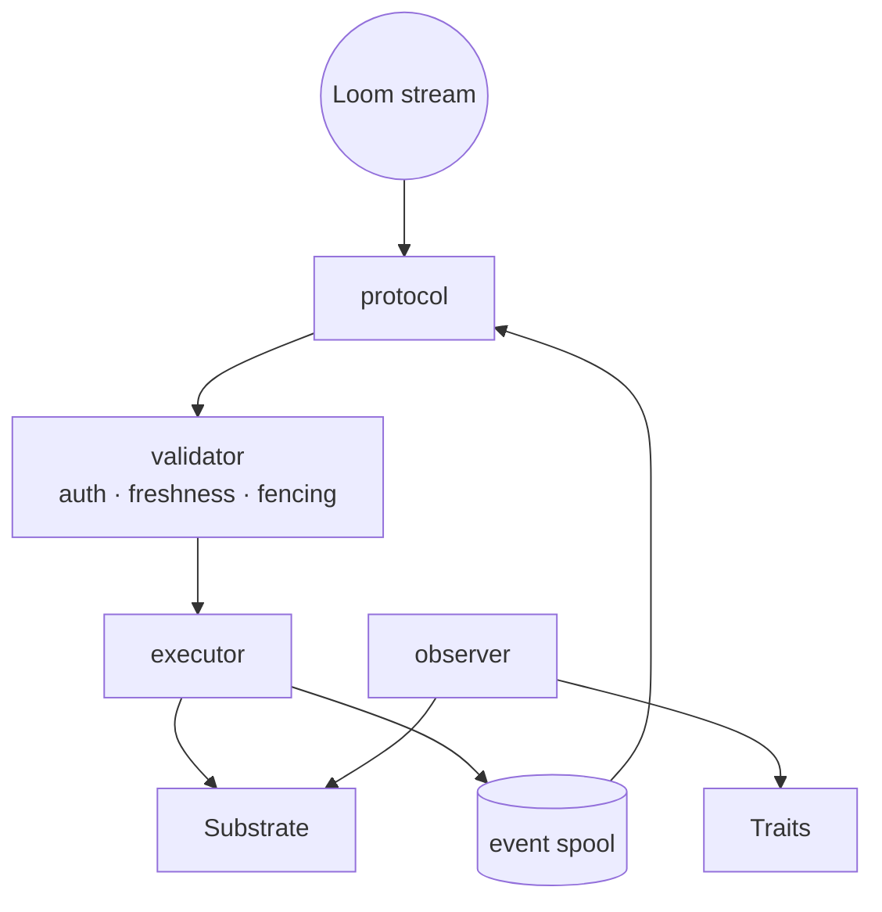
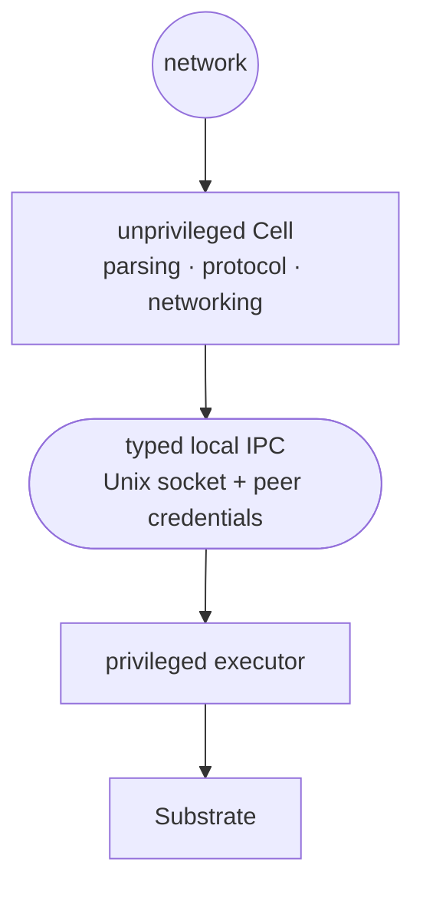
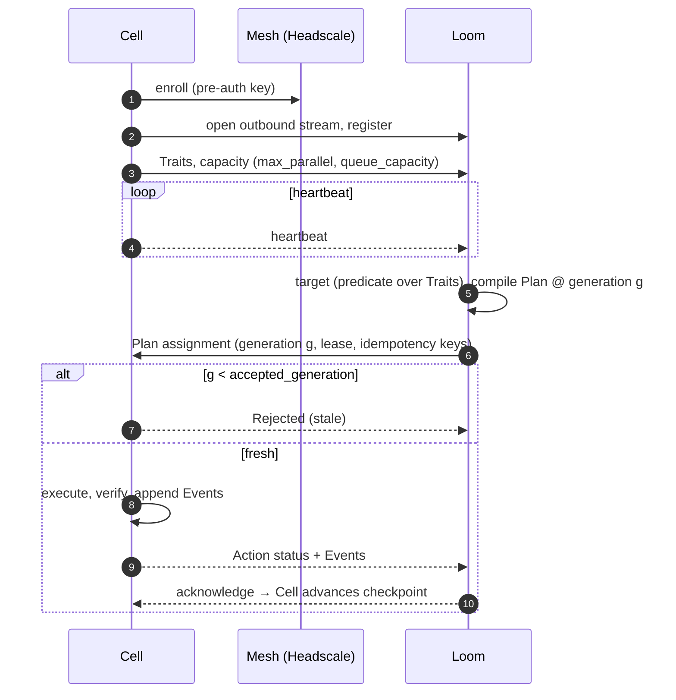
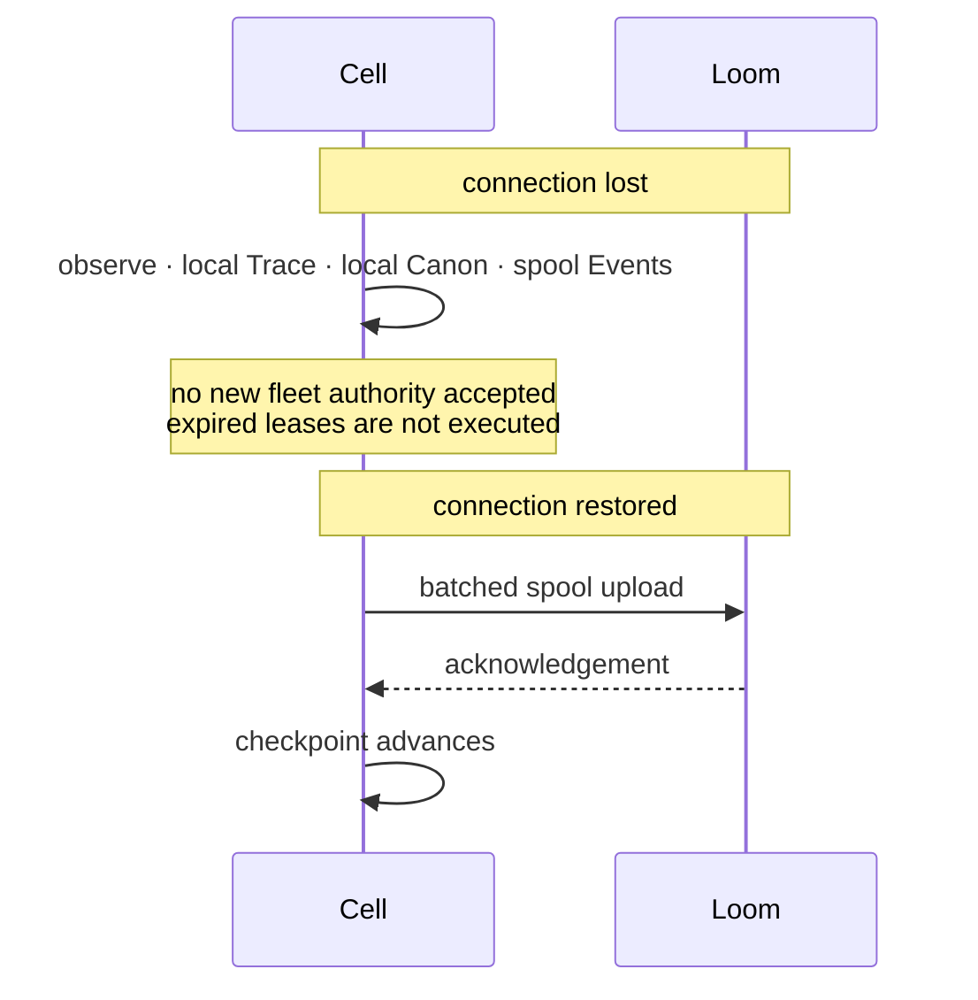
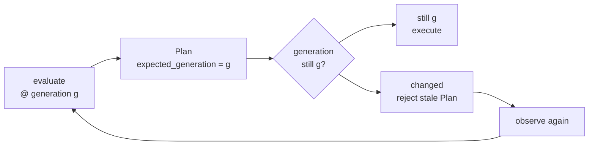

# Runtime

## Canon compilation

Human-readable Canon is never executed directly (spec §6).

The canonical IR serializes deterministically, so identical Canon always has
the same `CanonID` (invariant N12, see [formal/invariants.md](../formal/invariants.md)).

## Trace and Enforce share one pipeline

Trace is Enforce with the execution stage removed. It is not a separate
"dry-run" implementation (spec §37).

## Action lifecycle

| Transition | Condition |
|---|---|
| `Dispatched → Rejected` | stale generation or unauthorized |
| `Verifying → Succeeded` | postcondition observed |
| `Verifying → Failed` | postcondition not observed |
| `TimedOut → end` | outcome unknown; state is re-observed |

`TimedOut` does not mean the Action failed. The remote side may have completed
it. The outcome is recorded as unknown and settled by re-observing
(invariant N10).

## Cell internals

Planned privilege separation (spec §33, Phase 5):

## Loom ↔ Cell

### Disconnection and recovery

## Optimistic planning

