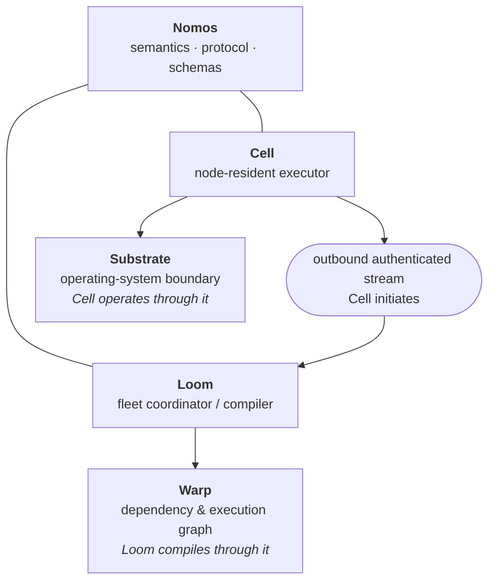
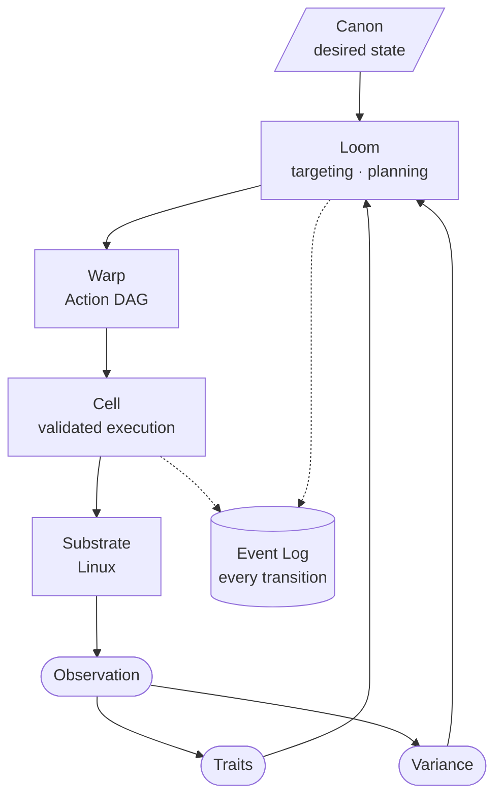
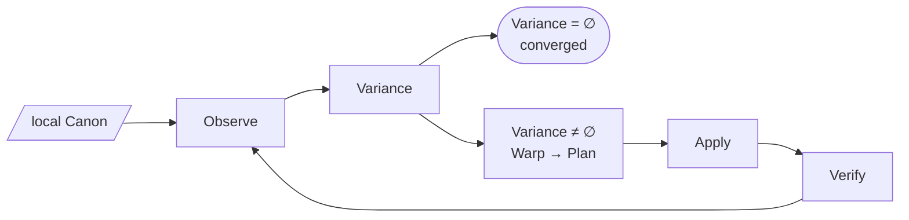
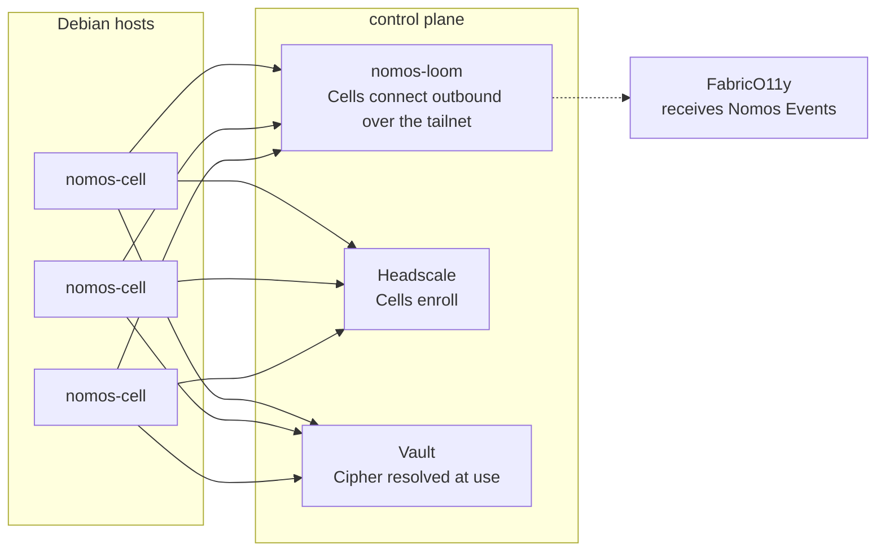
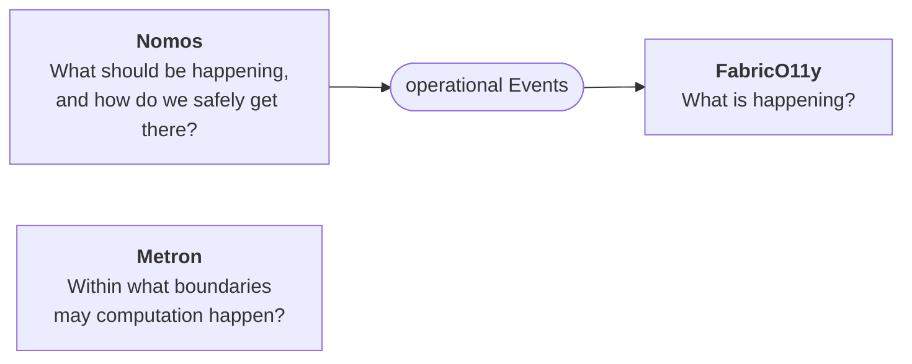

# System

## Components

Nomos is the project, the protocol, and the shared model. It is not a daemon. It has four architectural components (spec §2).

| Component | Binary or crate | Role |
| --- | --- | --- |
| Loom | `nomos-loom` | Accepts Canon, tracks Cells, resolves targets, plans, dispatches, and ingests Events. The single authority in v0. |
| Cell | `nomos-cell` | Discovers Traits, observes, executes, verifies, and spools Events. Works without Loom. |
| Warp | `nomos-warp` | Compiles resources and Variance into an Action DAG. |
| Substrate | `nomos-substrate` and its adapters | Typed operations against the OS, through native APIs instead of shell. |

## The control loop

A Cell runs the same loop locally, no Loom required:

## Deployment topology (v0)

One Loom, many Cells. Cells connect **outward** to Loom over the Mesh (Headscale, [ADR 0001](../adr/0001-headscale-mesh-adapter.md)). Secrets resolve at the point of use through the Cipher port (Vault, [ADR 0002](../adr/0002-vault-cipher-adapter.md)).

## Place in Moiric

Three independent systems with narrow integration surfaces. Each is useful on its own.
