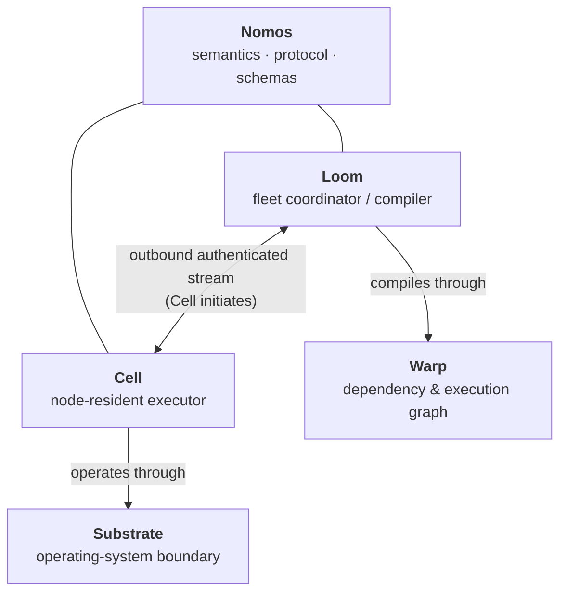
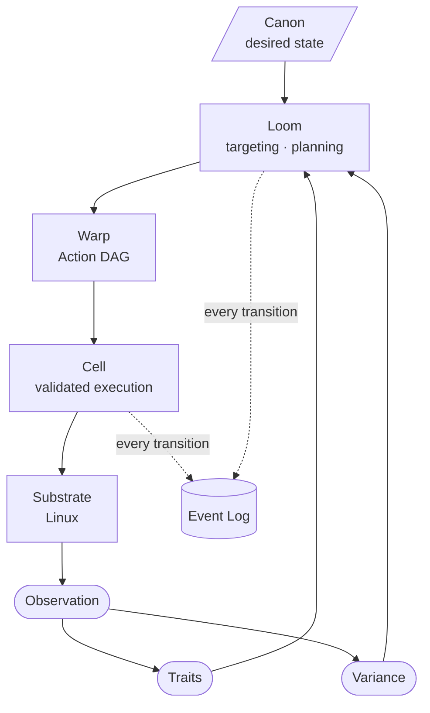
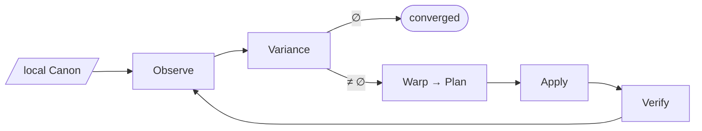
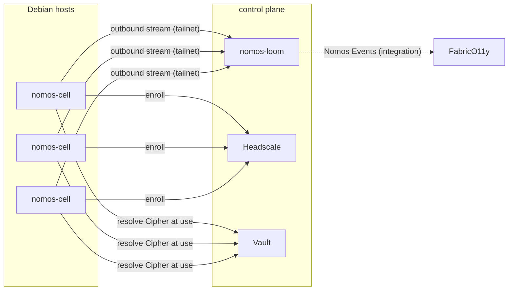
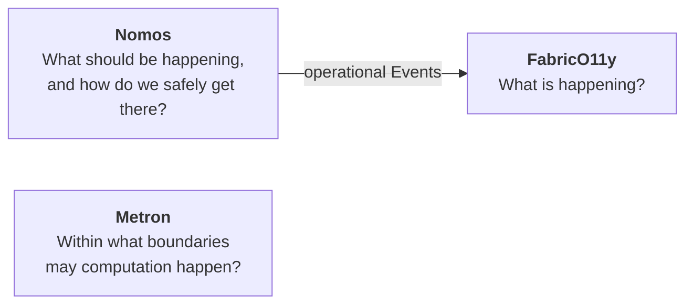

# System

## Components

Nomos is the project, protocol and shared model. It is not a daemon. It has
four architectural components (spec §2).

| Component | Binary / crate | Role |
|---|---|---|
| Loom | `nomos-loom` | Accepts Canon, tracks Cells, resolves targets, plans, dispatches, ingests Events. Single authority in v0. |
| Cell | `nomos-cell` | Discovers Traits, observes, executes, verifies, spools Events. Works without Loom. |
| Warp | `nomos-warp` | Compiles resources and Variance into an Action DAG. |
| Substrate | `nomos-substrate` (+ adapters) | Typed operations against the OS, using native APIs rather than shell. |

## The control loop

A Cell runs the same loop locally, with no Loom involved:

## Deployment topology (v0)

One Loom and many Cells. Cells connect **outward** to Loom over the Mesh
(Headscale, [ADR 0001](../adr/0001-headscale-mesh-adapter.md)). Secrets
resolve at the point of use through the Cipher port (Vault,
[ADR 0002](../adr/0002-vault-cipher-adapter.md)).

## Place in Moiric

They are independent systems with narrow integration surfaces.
