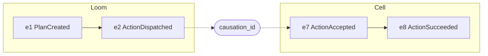

# Event Log

## Definitions

The Event Log $L$ is an append-only sequence of immutable Events (spec §26).

$$
L_{t+1} = L_t \mathbin{\Vert} e \qquad\text{(the only permitted transition)}
$$

**N7.** $e \in L_t \Rightarrow \forall t' > t:\ L_{t'}[\mathrm{pos}(e)] = e$.

## State as a fold

$$
\mathrm{State}_t = \mathrm{fold}(\mathrm{apply}, \mathrm{State}_0, L_t)
$$

Materialized state is a cache of this fold. It must be reproducible by
replaying from $\mathrm{State}_0$, or from a checkpoint $c$ with
$\mathrm{State}_c$ stored. Crash tests check that the cached and replayed
states agree.

## Ordering

Wall-clock time does not order Events across writers (spec §27).

| Order | Scope | Source |
|---|---|---|
| $\mathrm{seq}_w$ | total, within one writer $w$ | the writer's own counter |
| ingestion position | total, within Loom's log | Loom assigns on receipt |
| causality $\rightarrow$ | partial, across writers | explicit `causation_id` |

**Writer monotonicity.** For consecutive Events $e_n$, $e_{n+1}$ from writer
$w$: $\mathrm{seq}_w(e_{n+1}) > \mathrm{seq}_w(e_n)$. The counter is persisted
in the same transaction as the append, so a crash cannot reuse a sequence
number.

**Causality.** $a \rightarrow b$ holds if $b.\mathrm{causation\_id} = a.\mathrm{id}$,
or transitively through a chain of such links, or if both come from the same
writer with $\mathrm{seq}_w(a) < \mathrm{seq}_w(b)$. Timestamps are
informational only:

$$
\mathrm{ts}(a) < \mathrm{ts}(b) \not\Rightarrow a \rightarrow b
$$

`correlation_id`, `plan_id` and `action_id` group related Events without
implying order.

## Delivery to Loom

The Cell's spool uploads in `seq` order. Loom acknowledges the highest
contiguous `seq` it has persisted, and the Cell advances its checkpoint to
that value. Loom deduplicates re-uploads by $(w, \mathrm{seq}_w)$, so replaying
the spool after a crash is safe.

## Integrity (later mode)

v0 guarantees append-only behaviour through the API. It does not guarantee
tamper evidence. A later mode adds a hash chain:

$$
H_0 = H(\text{genesis}), \qquad H_n = H(H_{n-1} \mathbin{\Vert} \mathrm{enc}(e_n))
$$

Altering any $e_i$ changes every $H_j$ for $j \ge i$. Signed checkpoints over
$H_n$, or Merkle trees for inclusion proofs, would then make history
externally verifiable (spec §28).
