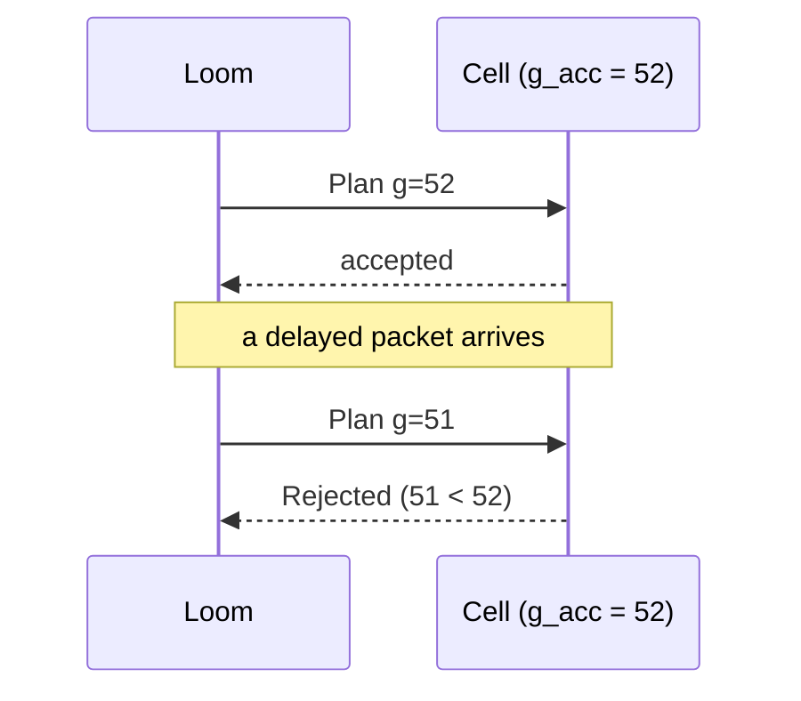

# Fencing and Idempotency

Delivery between Loom and Cell is **at least once**. Safety comes from two mechanisms: fencing rejects obsolete authority, and idempotency keys deduplicate retransmissions. Nomos does not claim exactly-once execution (spec §19–§20).

## Fencing

Loom assigns every Plan a generation $g$ from a monotonically increasing counter. Each Cell $n$ persists $g^{acc}_n$ and the `PlanID` accepted at that generation.

```text
on_plan(P):
    if P.g < g_acc:                          reject(Stale)
    if P.g = g_acc and P.id ≠ plan_at(g_acc): reject(Conflict)
    persist(g_acc := P.g, plan_at(P.g) := P.id)   # durable before any execution
    if lease_expired(P):                     reject(Expired)
    execute(P)
```



**Lemma 1 (monotonicity).** $g^{acc}_n$ never decreases, including across crashes.

*Proof.* The value is only ever assigned $P.g$ when $P.g \ge g^{acc}_n$. It is persisted before any effect, so recovery reads a value at least as large as any value previously acted on. $\square$

**Theorem (N5).** If an Action $a$ of Plan $P$ executes on $n$, then $g(P) \ge g^{acc}_n$ at the moment of execution, *provided that nothing can raise $g^{acc}_n$ between the check and the effect*.

*Proof.* Execution follows the check $P.g \ge g^{acc}_n$ and the persist step. By Lemma 1, $g^{acc}_n$ can only have been raised afterwards by accepting a newer Plan, which the proviso excludes. The remaining Actions of $P$ re-check before each dispatch, so the check is per Action, not per Plan. $\square$

**The check-to-use gap.** The proviso is not established by the algorithm above. An Action passes the check, its task is descheduled, a Plan with $g = 52$ is accepted and persisted, and the Action then issues its D-Bus job under $g = 51$ (counterexample [`fence-race`](../research/2026-09-28-typed-core/README.md)). A counter cannot revoke a job the service manager has already started. The gap closes in one of two ways, and choosing is an ADR ([ADR 0010](../adr/0010-effect-recovery-and-fencing.md), proposed): re-check under the same lock that admits the effect, so that check and effect are atomic with respect to acceptance, or refuse to accept a superseding Plan until in-flight Actions have drained or been cancelled. Either way, the Cell serializes admission for Loom Plans and for standalone local Plans through one path, because a local `enforce` is authority too. Experiment `fence-interleavings` exercises the interleavings once there is a second authority to supersede.

**Single active authority.** The second guard (equal generation, different `PlanID`) means a node never accepts two conflicting Plans at the same generation.

To be modeled in [`formal/tla/Fencing.tla`](../../formal/tla/).

## Idempotency

Every Action carries an idempotency key $k$. The Cell keeps a durable map $M: k \mapsto \mathrm{outcome}$.

```text
on_action(a):
    match M[a.k]:
        Completed(r)  → return r                       # duplicate delivery
        InFlight      → return Unknown → re-observe     # crashed mid-execution
        absent        → M[a.k] := InFlight (durable)
                        r := apply_and_verify(a)
                        M[a.k] := Completed(r)
                        return r
```

**Scope of $k$.** The key names one execution of one Action within one Plan. It is not a digest of the Action's semantic content. If it were, a `Completed` entry for "ensure `/etc/x` has digest $d$" would suppress every later repair of the same file after new drift (counterexample [`dedup-scope`](../research/2026-09-28-typed-core/README.md)). Retries of the same delivery share $k$. A new reconciliation run that plans the same repair gets a new $k$. How long $M$ retains keys is open (spec §62).

**Claim.** A duplicate delivery of a completed Action does not cause a second apply.

*Proof.* `Completed` is recorded before the result is returned. Any later delivery with the same key finds it and returns the stored result. $\square$

**The crash window.** A crash between `apply` and recording `Completed` leaves the key `InFlight`. The outcome is unknown (**N10**). Nomos does not blindly re-apply. It observes again, and because reconciliation is level-triggered, the new plan comes from the new Assessments. If the first attempt took effect, the Condition assesses as Satisfied and nothing is re-applied (see [reconciliation](reconciliation.md#fixed-point-n3)). Effect-level idempotence therefore comes from observing again, not from delivery guarantees. The network is allowed to be unreliable. The Cell is not.

That argument holds only for effects Variance can see. A configuration file replaced before the crash shows no Variance afterward, yet the service that read it still runs the old contents, and the restart that `on_change` would have triggered is gone (counterexample [`lost-refresh`](../research/2026-09-28-typed-core/README.md)). A running service is not evidence of which configuration it loaded. Either the obligation to refresh is persisted before the file is replaced, or the service exposes the revision it loaded and that revision is part of the resource's observation. Experiment `refresh-recovery`, [ADR 0009](../adr/0009-warp-activation-semantics.md), proposed; the Warp side is in [warp.md](warp.md#known-gaps).

## Optimistic Planning

A Plan compiled against node-state generation $s$ carries `expected_generation = s`. Before execution, the authority checks that the current generation still equals $s$. If it does not, the Plan is rejected, state is observed again, and the Plan is recompiled (spec §17).
