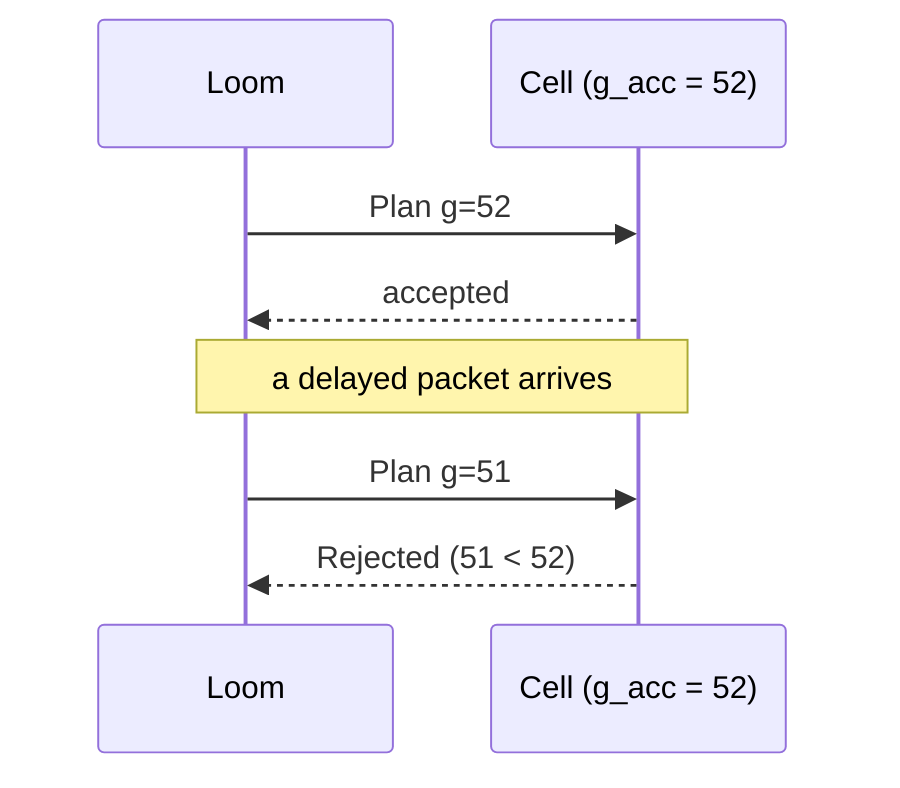

# Fencing and Idempotency

Delivery between Loom and Cell is **at least once**. Safety comes from two mechanisms: fencing rejects obsolete authority, and idempotency keys deduplicate retransmissions. Nomos does not claim exactly-once execution (spec §19–§20).

## Fencing

Loom assigns every Plan a generation $g$ from a monotonically increasing counter. Each Cell $n$ persists $g^{acc}_n$ and the `PlanID` accepted at that generation.

```text
on_plan(P):
    if P.g < g_acc:                          reject(Stale)
    if P.g = g_acc and P.id ≠ plan_at(g_acc): reject(Conflict)
    persist(g_acc := P.g, plan_at(P.g) := P.id)   # durable before any execution
    if lease_expired(P):                     reject(Expired)
    execute(P)
```



**Lemma 1 (monotonicity).** $g^{acc}_n$ never decreases, including across crashes.

*Proof.* The value is only ever assigned $P.g$ when $P.g \ge g^{acc}_n$. It is persisted before any effect, so recovery reads a value at least as large as any value previously acted on. $\square$

**Theorem (N5).** If an Action $a$ of Plan $P$ executes on $n$, then $g(P) \ge g^{acc}_n$ at the moment of execution.

*Proof.* Execution follows the check $P.g \ge g^{acc}_n$ and the persist step. By Lemma 1, $g^{acc}_n$ can only have been raised afterwards by accepting a newer Plan. The remaining Actions of $P$ re-check before each dispatch, so the check is per Action, not per Plan. $\square$

**Single active authority.** The second guard (equal generation, different `PlanID`) means a node never accepts two conflicting Plans at the same generation.

To be modeled in [`formal/tla/Fencing.tla`](../../formal/tla/).

## Idempotency

Every Action carries an idempotency key $k$. The Cell keeps a durable map $M: k \mapsto \mathrm{outcome}$.

```text
on_action(a):
    match M[a.k]:
        Completed(r)  → return r                       # duplicate delivery
        InFlight      → return Unknown → re-observe     # crashed mid-execution
        absent        → M[a.k] := InFlight (durable)
                        r := apply_and_verify(a)
                        M[a.k] := Completed(r)
                        return r
```

**Claim.** A duplicate delivery of a completed Action does not cause a second apply.

*Proof.* `Completed` is recorded before the result is returned. Any later delivery with the same key finds it and returns the stored result. $\square$

**The crash window.** A crash between `apply` and recording `Completed` leaves the key `InFlight`. The outcome is unknown (**N10**). Nomos does not blindly re-apply. It observes again, and because reconciliation is level-triggered, the new plan comes from the new $\mathrm{diff}(D, O)$. If the first attempt took effect, Variance is $\varnothing$ and nothing is re-applied (see [reconciliation](reconciliation.md#fixed-point-n3)). Effect-level idempotence therefore comes from observing again, not from delivery guarantees. The network is allowed to be unreliable. The Cell is not.

## Optimistic Planning

A Plan compiled against node-state generation $s$ carries `expected_generation = s`. Before execution, the authority checks that the current generation still equals $s$. If it does not, the Plan is rejected, state is observed again, and the Plan is recompiled (spec §17).
