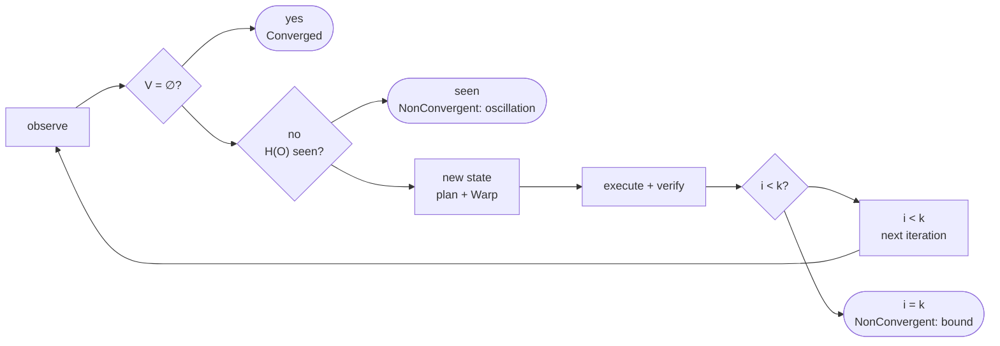

# Reconciliation

## Model

For each managed resource $r$, a driver provides (spec §9):

$$
\begin{aligned}
O_r &= \mathrm{observe}(r) \\
V_r &= \mathrm{diff}(D_r, O_r) \\
A_r &= \mathrm{plan}(V_r) \\
&\phantom{=}\ \mathrm{apply}(A_r) \\
&\phantom{=}\ \mathrm{verify}(D_r, O'_r)
\end{aligned}
$$

**Soundness requirement on `diff`.** For every driver:

$$
\mathrm{diff}(D, O) = \varnothing \iff O \models D
$$

Here $O \models D$ means "the observation satisfies the desired spec".
Every correctness result below depends on this requirement. Each driver must
therefore test it directly.

**Plan purity.** $\mathrm{plan}$ is a function of Variance only, and
$\mathrm{plan}(\varnothing) = \emptyset$.

## Algorithm

```text
enforce(C, bound k):
    history := ∅
    for i in 1..=k:
        O := observe(C)
        V := diff(C, O)
        if V = ∅:            return Converged
        h := H(O)
        if h ∈ history:      return NonConvergent(oscillation)
        history := history ∪ {h}
        P := warp(plan(V))
        execute(P)           # each Action: apply, then verify
        if a hard failure:   return Failed
    return NonConvergent(bound)
```

Trace is the same procedure with `execute` removed and the loop run once
(spec §37).



## Fixed point (N3)

**Claim.** If $\mathrm{Enforce}(C, S) = S'$ with
$\mathrm{diff}(C, S') = \varnothing$, then $\mathrm{Enforce}(C, S')$ performs
no mutating Action.

*Proof sketch.* In state $S'$ the first iteration observes $O = S'$. The first
iteration computes $\mathrm{diff}(C, S') = \varnothing$ and returns
`Converged` before `plan` or `execute` is reached. No Action is produced, so
none mutates. $\square$

The property test is therefore
$\mathrm{enforce}(\mathrm{enforce}(S)) = \mathrm{enforce}(S)$, with zero
mutating Actions in the second run.

## Termination

**Claim.** `enforce` terminates after at most $k$ iterations.

*Proof.* The loop variable is bounded by $k$. Every exit path either returns
or increments $i$. $\square$

Oscillation detection is a sharper early exit. Suppose an external writer $B$
restores a previous state $X$ after Nomos changes it. Then some later
observation repeats an earlier one, so $H(O_j) = H(O_i)$ for some $j > i$.
Nomos reports this as oscillation rather than running until the bound.
Oscillation that never repeats an exact state still ends at $k$.

## Verification (N6)

An Action reaches `Succeeded` only through `Verifying`. `Verifying` succeeds
only if $\mathrm{verify}(D_r, O'_r)$ holds on a fresh observation. An exit
code is never accepted as evidence.
