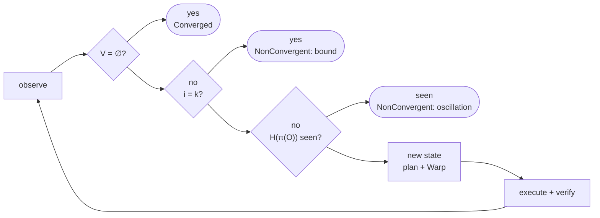

# Reconciliation

## Model

For each managed resource $r$, a driver provides (spec §9):

$$
\begin{aligned}
O_r &= \mathrm{observe}(r) \\
V_r &= \mathrm{diff}(D_r, O_r) \\
A_r &= \mathrm{plan}(V_r) \\
&\phantom{=}\ \mathrm{apply}(A_r) \\
&\phantom{=}\ \mathrm{verify}(D_r, O'_r)
\end{aligned}
$$

**Soundness requirement on `diff`.** For every driver:

$$
\mathrm{diff}(D, O) = \varnothing \iff O \models D
$$

Here $O \models D$ means "the observation satisfies the desired spec". Every correctness result below rests on this requirement, so every driver tests it directly.

**Plan purity.** $\mathrm{plan}$ is a function of Variance only, and $\mathrm{plan}(\varnothing) = \emptyset$.

## Algorithm

```text
enforce(C, bound k):
    history := ∅
    for i in 0..=k:
        O := observe(C)
        V := diff(C, O)
        if V = ∅:            return Converged
        if i = k:            return NonConvergent(bound)
        h := H(π(O))
        if h ∈ history:      return NonConvergent(oscillation)
        history := history ∪ {h}
        P := warp(plan(V))
        execute(P)           # each Action: apply, then verify
        if a hard failure:   return Failed
```

The loop observes $k + 1$ times and executes at most $k$ times. The observation after the last permitted execution is what makes the bound honest. The earlier draft tested $V = \varnothing$ only before `execute`, so a run whose $k$-th execution converged the host fell through to `NonConvergent(bound)`. The research snapshot reproduced exactly that with $k = 1$ (counterexample [`final-check`](../research/2026-09-28-typed-core/README.md)).

Trace is the same procedure with `execute` removed and the loop run once (spec §37).



## Fixed Point (N3)

**Claim.** If $\mathrm{Enforce}(C, S) = S'$ with $\mathrm{diff}(C, S') = \varnothing$, then $\mathrm{Enforce}(C, S')$ performs no mutating Action.

*Proof sketch.* In state $S'$, the first iteration observes $O = S'$, computes $\mathrm{diff}(C, S') = \varnothing$ and returns `Converged` before `plan` or `execute` is reached. No Action is produced, so none mutates. $\square$

The property test is therefore $\mathrm{enforce}(\mathrm{enforce}(S)) = \mathrm{enforce}(S)$, with zero mutating Actions in the second run.

## Termination

**Claim.** `enforce` returns after at most $k$ executions and $k + 1$ observations, provided every call to `observe` and `execute` returns.

*Proof.* The loop variable is bounded by $k$. Every exit path either returns or increments $i$. $\square$

The proviso carries the weight. A bound on iterations is not a bound on time. A D-Bus call that never answers, or a package manager waiting on a lock, holds the loop open for as long as it likes. So every `observe` and `execute` runs under a deadline that returns control to the loop. A deadline that fires does not undo the effect it interrupted: the restart may still be in progress when the loop regains control. The Action's outcome is then unknown (N10), the run ends as a hard failure, and the next run observes before it does anything else. Bounding the caller's wait and bounding the effects are two obligations, and only the first is proved here.

## Oscillation

Suppose an external writer $B$ restores a previous state $X$ every time Nomos changes it. Some later observation then repeats an earlier one, $H(\pi(O_j)) = H(\pi(O_i))$ for some $j > i$, and Nomos reports oscillation instead of running to the bound. Oscillation that never repeats an exact state still stops at $k$. Nomos may lose an argument with another controller. It will not lose it forever.

A repeated fingerprint is evidence of oscillation, not proof of it. Two qualifications keep the diagnostic honest.

- **The fingerprint covers a projection.** $\pi(O)$ is the observation restricted to the properties Canon expresses for the resources it names. Hashing the whole host would include timestamps and counters that never repeat, and no oscillation would ever be detected.
- **A repeat needs quiescence.** A service whose start has not completed by the next observation looks like a reverted state and is not one. *Working definition:* a repeated fingerprint counts only when no Action from the previous iteration is still in flight. With work outstanding, the loop waits for it to settle or for its deadline before it classifies the observation.

## Verification (N6)

An Action reaches `Succeeded` only through `Verifying`. `Verifying` succeeds only if $\mathrm{verify}(D_r, O'_r)$ holds on a fresh observation. An exit code is never evidence.

## Known Gaps

The 2026-09-28 research snapshot ([evaluation](../research/2026-09-28-typed-core/README.md)) identified three things this document does not model. Each is assigned to a grounding experiment in the [grounding plan](../research/2026-09-28-typed-core/grounding-plan.md).

- **Evidence that supports neither outcome.** `diff` returns Variance or nothing. A denied read, a stale observation, or two observations that contradict each other is neither. Casting it to Variance would plan a mutation from ignorance. Casting it to satisfaction would hide drift. A third per-resource outcome is proposed, with one rule attached: an unknown for one resource never erases a known Variance for another. Experiment `assessment-algebra`, ADR candidate `evidence-model`.
- **Composition.** The model has one controller. Two controllers that each converge alone can oscillate together when they share a file or a sysctl. Experiment `controller-composition`.
- **Conditional liveness.** Convergence assumes stable intent, sufficient permissions, fair scheduling, and bounded interference. None of these is stated as an assumption yet. Experiment `bounded-convergence`.
