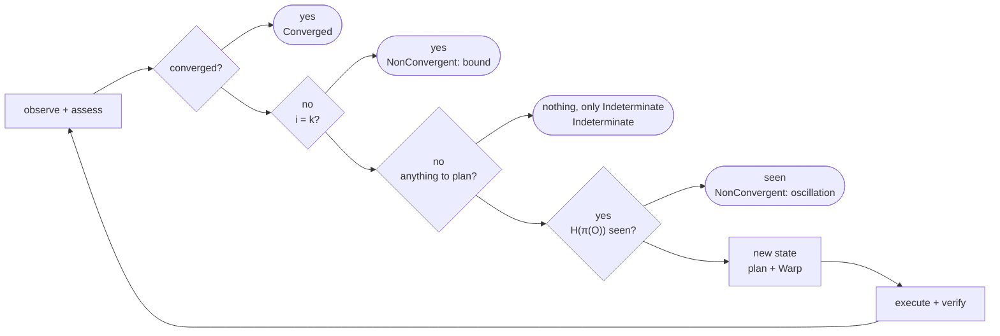

# Reconciliation

## Model

For each Condition $C_r$ on a managed resource $r$, core provides (spec §8–§9, [ADR 0005](../adr/0005-assessment-vocabulary.md), [ADR 0006](../adr/0006-kernel-contract.md)):

$$
\begin{aligned}
O_r &= \mathrm{observe}(r) \\
A_r &= \mathrm{assess}(C_r, O_r) \in \{\mathrm{Satisfied},\ \mathrm{Variance}(\delta),\ \mathrm{Indeterminate}(\rho)\}
\end{aligned}
$$

**Soundness requirement on `assess`.** For every resource kind:

$$
\mathrm{assess}(C, O) = \mathrm{Satisfied} \iff O \text{ is sufficient evidence and } O \models C
$$

$$
\mathrm{assess}(C, O) = \mathrm{Variance}(\delta) \iff O \text{ is sufficient evidence and } O \not\models C
$$

Here $O \models C$ means the Observation satisfies the Condition, and *sufficient* means the Observation was collected, is fresh under the policy, and does not contradict another Observation of $r$. Anything else is $\mathrm{Indeterminate}(\rho)$ with the reason $\rho$. Every correctness result below rests on this requirement, so every resource kind tests it directly, including that a denied read never assesses as Satisfied or as Variance.

**Assessments do not aggregate.** A Canon's report is the set $\{A_r\}$. An Indeterminate Assessment of one resource does not erase a Variance of another, and a Variance does not become Indeterminate because an unrelated resource could not be observed (counterexample [`partial-assessment`](../research/2026-09-28-typed-core/README.md)).

**Plan inputs.** Planning is a pure function of explicit inputs:

$$
\mathrm{Plan} = P(\mathit{Canon},\ \{A_r\},\ \mathit{Obligations},\ \mathit{Capabilities},\ \mathit{Policy})
$$

Pure means deterministic with no hidden inputs and no effects, not "one argument". Indeterminate Assessments contribute no Actions. With every Assessment Satisfied and no Obligation, $P$ returns the empty Plan.

## Convergence

Empty Variance is not convergence. A configuration file can hold revision 2 while the service still runs revision 1, because the crash that lost the restart left the file Assessment Satisfied. So:

$$
\mathrm{Converged} \iff
\forall r: A_r = \mathrm{Satisfied}
\ \wedge\
\mathit{Obligations} = \varnothing
\ \wedge\
\forall e \in \mathit{RelevantEffects}: \mathrm{Settled}(e)
$$

An Obligation is a follow-up effect a completed change requires and no Condition can observe, recorded durably before the change that creates it. An effect is Settled when its outcome is known and it can cause no further change; a satisfied Condition is not settlement evidence ([warp, Conflict Keys](warp.md#conflict-keys)).

## Algorithm

```text
enforce(C, bound k):
    history := ∅
    for i in 0..=k:
        O := observe(C)
        A := assess(C, O)
        if converged(A, obligations, effects):            return Converged
        if i = k:                                          return NonConvergent(bound)
        if no Variance in A and obligations = ∅:
            if some effect is not Settled:                 await settlement or its deadline; continue
            return Indeterminate(reasons of A)             # only Indeterminate Assessments remain
        h := H(π(O))
        if h ∈ history:                                    return NonConvergent(oscillation)
        history := history ∪ {h}
        P := warp(plan(C, A, obligations, capabilities, policy))
        execute(P)                                         # each Action: apply, then verify
        if a hard failure:                                 return Failed
```

The loop observes $k + 1$ times and executes at most $k$ times. The observation after the last permitted execution is what makes the bound honest. The earlier draft tested only before `execute`, so a run whose $k$-th execution converged the host fell through to `NonConvergent(bound)` (counterexample [`final-check`](../research/2026-09-28-typed-core/README.md)).

`Indeterminate` is a distinct outcome. It is not `Converged`, because nothing was established, and not `Failed`, because nothing went wrong that a retry would fix. It carries every reason, so an operator can see which permission or which contradiction to resolve.

Trace is the same procedure with `execute` removed and the loop run once (spec §37).



**As the transition kernel runs it.** Milestone `05-transition-kernel` implements the loop as `step` ([ADR 0006](../adr/0006-kernel-contract.md) note) with three working definitions. The loop observes only when every effect is Settled, so the settlement condition on oscillation holds by construction. An iteration whose Plan dispatched nothing, because every remaining Action is Blocked behind an Indeterminate anchor, ends the run `Indeterminate`, since repeating it would only repeat the same unknown. `Failed` lists known failures and unknown outcomes separately: a Failed or Rejected Action is a known failure, and a TimedOut one is an unknown outcome.

## Fixed Point (N3)

**Claim.** If $\mathrm{Converged}(C, S')$ holds, then $\mathrm{Enforce}(C, S')$ performs no mutating Action.

*Proof sketch.* The first iteration observes $O = S'$, every Assessment is Satisfied, no Obligation is pending, and every relevant effect is Settled, so `converged` returns before `plan` or `execute` is reached. No Action is produced, so none mutates. $\square$

The law is stated over $\mathrm{Converged}$, not over empty Variance. A host whose files match but whose service still owes a refresh is not converged, and the refresh is a required mutation, not a violation of N3. The property test is $\mathrm{enforce}(\mathrm{enforce}(S)) = \mathrm{enforce}(S)$ with zero mutating Actions in the second run, and a second test that a pending Obligation produces exactly its discharge and nothing else.

## Termination

**Claim.** `enforce` returns after at most $k$ executions and $k + 1$ observations, provided every call to `observe`, `execute`, and `await settlement` returns.

*Proof.* The loop variable is bounded by $k$. Every exit path either returns or increments $i$. $\square$

The proviso carries the weight. A bound on iterations is not a bound on time. A D-Bus call that never answers, or a package manager waiting on a lock, holds the loop open for as long as it likes. So every `observe`, `execute`, and settlement wait runs under a deadline that returns control to the loop. A deadline that fires does not undo the effect it interrupted, and it does not settle it: the restart may still be in progress when the loop regains control. The Action's outcome is then unknown (N10), its reservation holds, the run ends as a hard failure, and the next run observes before it does anything else. Bounding the caller's wait and bounding the effects are two obligations, and only the first is proved here.

## Oscillation

Suppose an external writer $B$ restores a previous state $X$ every time Nomos changes it. Some later observation then repeats an earlier one, $H(\pi(O_j)) = H(\pi(O_i))$ for some $j > i$, and Nomos reports oscillation instead of running to the bound. Oscillation that never repeats an exact state still stops at $k$. Nomos may lose an argument with another controller. It will not lose it forever.

A repeated fingerprint is evidence of oscillation, not proof of it. Two qualifications keep the diagnostic honest.

- **The fingerprint covers a projection.** $\pi(O)$ is the observation restricted to the properties Canon expresses for the resources it names. Hashing the whole host would include timestamps and counters that never repeat, and no oscillation would ever be detected.
- **A repeat needs settlement.** A service whose start has not completed by the next observation looks like a reverted state and is not one. A repeated fingerprint counts only when every effect from the previous iteration is Settled. With effects outstanding, the loop waits for settlement or the deadline before it classifies the observation.

## Verification (N6)

An Action reaches `Succeeded` only through `Verifying`. `Verifying` succeeds only if $\mathrm{assess}(C_r, O'_r) = \mathrm{Satisfied}$ on a fresh Observation. An exit code is never evidence, and an Indeterminate Assessment is not a verification. Fresh means the Observation's collection window starts at or after the completion receipt; an Observation collected before the effect finished says nothing about it. An Indeterminate verification leaves the Action in `Verifying` until a fresh Observation decides or its deadline makes it `TimedOut`.

## Known Gaps

Assigned in the [grounding plan](../research/2026-09-28-typed-core/grounding-plan.md).

- **Settlement evidence per resource.** What shows that a file write, a service-manager job, or an opaque effect can cause no further change is resource-specific and not yet written down. Milestone 1 pull request 4.
- **Composition.** The model has one controller. Two controllers that each converge alone can oscillate together when they share a file or a sysctl. Experiment `controller-composition`.
- **Conditional liveness.** Convergence assumes stable intent, sufficient permissions, fair scheduling, and bounded interference. None of these is stated as an assumption yet. Experiment `bounded-convergence`.
