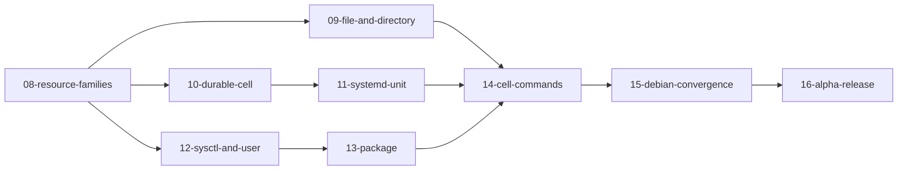

# Plan: Phase 1, the Masterless Cell

- **Status.** Accepted 2026-09-30, with the alpha release added the same day. `08-resource-families` and `09-file-and-directory` landed 2026-09-30; the four decisions below are settled.
- **Goal.** Spec §55, Phase 1: the Linux Substrate on Debian with `file`, `directory`, `system_user`, `systemd_unit`, `sysctl`, and `package`, and the commands `traits`, `trace`, and `enforce`. Done when a Debian machine converges locally from any supported starting state.
- **Then.** An alpha release, `0.1.0-alpha.1`, that an operator can install on any Debian 12 or 13 host on amd64 and use to converge it locally.
- **Not the goal.** Crash testing at every lifecycle boundary (the rest of Phase 2), Loom (Phase 3), the privileged helper (Phase 5), and Cipher providers (Phase 6).

The [grounding plan](../research/2026-09-28-typed-core/grounding-plan.md) made the kernel executable and checked it against one resource family, files, on the mock and on one Linux host. Phase 1 widens that to six families and a real service manager without loosening a single gate. The discipline carries over unchanged: a contract before code, a named test for every exit, semantic mutants chosen from the specification, receipts for every command a record cites, and no threshold anywhere.

## Where Phase 1 Starts

| Area | Established | Phase 1 adds |
| --- | --- | --- |
| Core model | Conditions, Observations, and Assessments for files: presence and exact content | A family per resource, each with its own evidence, requirements, and truth table |
| Substrate port | `Observe` and `Mutate` over `ResourcePath` and `FileEvidence` | The port generalized over resource families; S1 to S9 stated per family |
| Linux adapter | Regular files beneath a root: observe and atomic replace | The six families on a real Debian host, as root |
| Canon | Deterministic Concise Binary Object Representation (CBOR), schema versions, migration with lineage | Schema entries for the new families, with a migration and a compatibility vector for each |
| Composition | The footprint check, on the mock, outside admission | The check inside Canon admission (ADR 0008 §1) |
| Commands | The production driver, called from tests | `nomos-cell traits`, `trace`, and `enforce` on a `.cbor` artifact |

## Decisions

The owner settled four questions on 2026-09-29. Each becomes an ADR or an ADR amendment, in a specification commit, before the milestone it unblocks.

1. **Running a program at the boundary** (ADR 0013 §4), for `12-sysctl-and-user` and `13-package`: the method least likely to leave a lock, a half-written database, or an inconsistent shadow file behind. That is a direct `execve` of the distribution's own tool, `apt-get` and `dpkg` for packages and `useradd` and `usermod` for users, with a fixed argument vector per typed operation, an allowlisted absolute path, an empty environment apart from a fixed `PATH`, `LC_ALL=C`, and `DEBIAN_FRONTEND=noninteractive`, and no shell. These tools own the locking, the shadow files, and the package database; rewriting their files from Nomos, or binding the C++ `libapt-pkg`, would reimplement that locking and consistency and could get it wrong. Observation needs no program: the package database and the user database are read directly. Verification is core's, from a new Observation, whatever the tool's exit status said.
2. **The D-Bus client** (spec §12), for `11-systemd-unit`: `zbus`, a pure-Rust D-Bus implementation, through its blocking API, since the port is synchronous. The alternative, the `dbus` crate, binds the C `libdbus`. The handful of `org.freedesktop.systemd1` methods Nomos calls are declared in the adapter rather than pulled from a generated binding of the whole interface. A new workspace dependency, in a verifier commit.
3. **Where content comes from**, for `09-file-and-directory`: a content store managed by Nomos, an internal artifact repository. Blobs are addressed by the same digest the Canon names, immutable, and verified on every read. In Phase 1 it lives on the Cell and is filled from a bundle imported beside the `.cbor` artifact; in Phase 3, Loom serves it. The store is a port, so its ADR comes first.
4. **Where the Debian tests run**, for `09` onward: a disposable Debian container that boots systemd as PID 1, privileged, created fresh for each run, so the suites meet a real service manager, D-Bus, `apt`, and the shadow tools. A probe on 2026-09-30 ran it in this development sandbox: Docker 29.3.1 on cgroup v1, the Debian 12 image from Amazon's public mirror (Docker Hub refused with a rate limit), with `systemd`, `systemd-sysv`, and `dbus` added, run privileged on the host network and cgroup namespace. systemd reached `running` as PID 1 with no failed units; D-Bus `GetUnit` and `RestartUnit` calls to `org.freedesktop.systemd1` returned an object and a job; `useradd --system` created a user; and `apt-get install hello` installed a package through the agent proxy. Whether the suites also run in CI, on a hosted runner, is settled when `09-file-and-directory` wires the harness. The image recipe becomes a fixture, and the harness a `cargo xtask` command, by AGENTS.md rule 10.

## Milestones

Each milestone is a branch `milestone/<nn>-<name>`, merged with a merge commit, as before. The numbers continue the grounding plan's.

### 08-resource-families

Generalize the core model and the port from one family to many, on the mock only. Each family gets its requirement type, its evidence type, and an exhaustive requirement-by-evidence truth table, written into `docs/formal/` before the code, as the file family's was for [assessment-algebra](../research/2026-09-28-typed-core/results/assessment-algebra.md). The port's nine clauses are restated per family in [substrate-contract.md](../formal/substrate-contract.md). The Canon schema gains the families under a new schema version, with a migration from the current one and golden vectors. The footprint check moves into Canon admission: a Canon whose Conditions write one property twice is rejected before anything runs.

Exit: the mock passes the per-family suite for all six families; a Canon with overlapping written properties is rejected at admission (`SM-COMPOSE-001` still caught, and a new mutant for admission); every existing test and mutant still passes; Canon artifacts of the previous schema decode and migrate.

Landed 2026-09-30: [family-truth-tables](results/family-truth-tables.md), [admission-composition](results/admission-composition.md), and [canon-schema-3](results/canon-schema-3.md), with receipts in `verification/receipts/2026-09-30-resource-families.ndjson`. Implementing it amended the specification in three places, each in its own commit: keys order by name, then family; a Variance of a resource's own is a reason to run, which an unchanged `on_change` source cannot Skip (ADR 0009 note of 2026-09-30, for the owner's review); and the unit's refresh and refusals are stated.

### 09-file-and-directory

Files gain metadata (owner, group, mode) and directories become a family: presence, metadata, and whether unmanaged entries are tolerated. Metadata is set before the rename, as spec §11 draws it. Content comes from the content store of decision 3.

Exit: the Linux adapter passes the file and directory suites on Debian, with failure injection for a directory replaced by a file, a symbolic link in place of a directory, and a foreign change of mode between execution and verification.

Landed 2026-09-30: [linux-files-and-directories](results/linux-files-and-directories.md), on Debian 12 and 13 in containers run by `cargo xtask debian`, which CI now runs for both releases; [ADR 0017](../adr/0017-local-store.md) gives the content store, `nomos-store-fs`.

### 10-durable-cell

The Cell's Event Log on disk, so that what the kernel owes survives a crash or a reboot: a refresh Obligation recorded before a configuration change must still be there when the Cell starts again. An adapter of the `nomos-store` port, append-only, with a checksum per record and a sync before an append is acknowledged; the snapshot is a fold of the log, as in `05-transition-kernel`. [ADR 0012](../adr/0012-event-history.md) records the storage choice for the Cell. Physical crash testing at every lifecycle boundary stays in Phase 2.

Exit: a Cell killed after appending an Obligation and before discharging it recovers the Obligation from disk; a torn final record is detected and refused, never folded; a corrupted record fails the whole recovery loudly rather than being skipped.

### 11-systemd-unit

Units over D-Bus (`org.freedesktop.systemd1`), never `systemctl`: loaded, enabled, active, and a refresh as a restart or reload job whose completion is the settlement evidence. The refresh Obligation of `05-transition-kernel` meets a real service manager here.

Exit: a configuration change followed by a crash between replacement and restart still ends with the unit restarted (the `05` exit, now on a host); a job that fails leaves the Action Failed, not Converged; a unit that systemd cannot load is Indeterminate with its reason.

### 12-sysctl-and-user

`sysctl` through `/proc/sys`, which is file I/O and needs no program. `system_user` observed through the user database and changed under decision 1.

Exit: both suites pass on Debian; a sysctl the running kernel does not have is Indeterminate, not a Variance; a user whose numeric ID another account already holds is refused before any effect.

### 13-package

`package` under decision 1: installed, absent, or a pinned version, observed from the package database without running a program where possible.

Exit: install, removal, and a pin converge on Debian; a lock held by another package manager is Indeterminate or a retry, never a false Variance; the fixed-point property (spec §39) holds after convergence.

### 14-cell-commands

`nomos-cell traits`, `trace`, `enforce`, and `events` on a `.cbor` artifact, sharing one pipeline as spec §37 requires: `trace` differs from `enforce` only in never holding the mutate capability. Traits carry provenance, observation time, and stability (spec §4).

Exit: `trace` on a host with a denied read prints the Indeterminate Assessment and plans nothing for it; `trace` changes nothing (N1) on the Debian host, checked against a before-and-after projection; `enforce` ends `Converged`, `Indeterminate`, `NonConvergent`, or `Failed` exactly as [reconciliation.md](../formal/reconciliation.md) defines.

### 15-debian-convergence

The Phase 1 exit itself. The supported starting states are enumerated per family, not left open: for each Condition, absent, present and wrong, present and right, and each failure the family's suite injects. The demonstration Canon is a slice of spec §56: a system user, directories, a configuration file, a sysctl, a package, and a systemd service with its refresh.

Exit: from every enumerated starting state, `enforce` converges the Debian host, a second `enforce` executes nothing (spec §39, N3), and `trace` afterward reports every Condition Satisfied.

### 16-alpha-release

What turns a converging Cell into something an operator installs. A static `nomos-cell` binary for amd64, linked against musl so one build runs on every supported Debian; a Debian package with the binary, a systemd service and timer that run `enforce` on an interval, and the Cell's state directory; a Canon authoring kit, a template crate that builds a `.cbor` artifact and its content bundle; and the documents an operator reads first: install, author a Canon, trace, enforce, read the events, uninstall. Every claim the documents make is a test.

Exit: the package installs, upgrades, and purges cleanly on fresh Debian 12 and Debian 13 containers booting systemd; the demonstration Canon of `15` converges from each enumerated starting state through the installed service; the release notes list what `0.1.0-alpha.1` does and does not establish, each with its record.

## Experiments

| Experiment | Milestone | Question |
| --- | --- | --- |
| `family-truth-tables` | `08-resource-families` | Does each family's assessment match its written truth table on every listed case, with Indeterminate never collapsing to Variance? |
| `admission-composition` | `08-resource-families` | Does admission reject every overlapping written property, and only those? |
| `durable-log` | `10-durable-cell` | Does recovery from disk restore every Obligation and Event that was acknowledged, and refuse a torn or corrupted log? |
| `linux-families` | `09` and `11` to `13` | Does each family on Linux pass the same suite as the mock, under failure injection? |
| `systemd-refresh` | `11-systemd-unit` | Does a refresh survive a crash between the change and the job, on a real service manager? |
| `trace-is-enforce` | `14-cell-commands` | Do `trace` and `enforce` compute the same Plan on the same evidence? |
| `debian-fixed-point` | `15-debian-convergence` | Does every enumerated starting state converge, and does a second run execute nothing? |

Each ends in a result record under [results/](results/), with receipts, in the form the grounding plan used.

## Carried Forward

- **Procedural macros in the Canon build.** The hermeticity check cannot see one ([build-hermeticity](../research/2026-09-28-typed-core/results/build-hermeticity.md)). A static check over `cargo metadata` that refuses a procedural-macro crate in a Canon crate's graph, with a negative-control fixture, fits before `14-cell-commands` makes artifacts an operator path.
- **ADR 0008 and ADR 0013.** `08-resource-families` puts the ownership check on the admission path and `09` to `13` run it on a host, which is the evidence §1 and §2 of each still lack. Identity (ADR 0008 §3 and §4) and secrets (ADR 0013 §3) stay with Phases 3, 4, and 6.
- **Mutation cost.** Settled 2026-09-30 ([mutation-calibration](../research/2026-09-28-typed-core/results/mutation-calibration.md)): the weekly run mutates only the week's changes, and mutation runs leave out the repository-corpus test, so mutating the new adapter code costs seconds a mutant.

## Exit Criteria

1. Milestones `08` to `16` merged, each with its exit demonstrated by a named test, and `0.1.0-alpha.1` tagged.
2. A result record for every experiment above, and a receipt for every command a record cites.
3. The verification matrix's environment column filled for every family, each entry naming its Debian host.
4. ADR 0013 §4 amended with decision 1, the content-store ADR accepted, and ADR 0008 §1 and §2 accepted or kept Proposed with the reason recorded.
5. The required CI path still small and green; the Debian suites on the path or on a schedule, as decision 4's probe shows.
