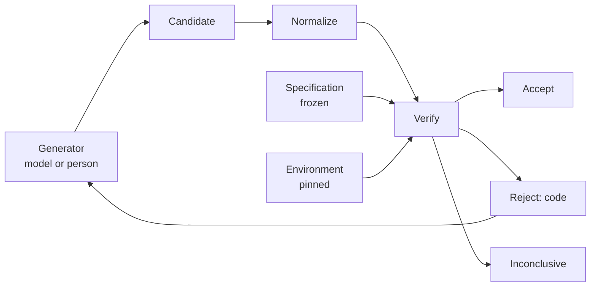

# Framework

The asymmetry, stated once, and then one card per theme. Each card separates what a source showed from what we infer, and names the experiment that would test the inference on Nomos. Sources are cited by their heading in [sources.md](sources.md).

## The Generator-Verifier Asymmetry

A **generator** produces candidates. A **verifier** judges them. In this repository the generator is usually a language model driving an editor, sometimes a person, and the verifier is the toolchain, the tests, the `cargo xtask` gates, and eventually a model checker or a proof assistant.

$$\mathit{candidate} \sim \mathrm{Generator}(\mathit{prompt}, \mathit{context}, \mathit{seed}, \ldots)$$

$$\mathrm{Verify}(\mathrm{normalize}(\mathit{candidate}), \mathit{specification}, \mathit{environment}) \in \{\mathrm{Accept}, \mathrm{Reject}, \mathrm{Inconclusive}\}$$

The generator is a sampling process. Nothing about it is assumed deterministic, and nothing requires two generators, or two runs of one, to produce byte-identical implementations. The verifier is a function: for a normalized candidate, a frozen specification, and a pinned environment, it returns the same verdict every time. Normalization is `cargo fmt` and whatever canonical form a gate defines; the specification is the documents, the invariants, the tests, and the gates; the environment is the pinned toolchain, the lockfile, and the fixtures.

Three consequences follow, and every card below belongs to one of them.

1. **The verifier's letter is the target.** A generator optimized for acceptance satisfies whatever the verifier checks, not what the author meant. When the two differ, the difference is where the generator goes. The specification and the verifier are therefore the assets to protect, and a change to either is a different kind of change from a change to the implementation.
2. **A generated oracle is not independent.** A test written by the generator encodes the generator's belief about the code, which is also the belief the code encodes. Independence has to come from an invariant stated before the code, a reference written another way, a relation between inputs, or a proof obligation.
3. **A verdict is a record only with its inputs.** A green run without the candidate's identity, the specification revision, the environment, and the bounds is a claim. Inconclusive is a verdict; a check that did not run has none.

## Cards

### Agent-Based Formal Verification

- **Finding.** Given a complete specification, agents complete a majority of Verus proof tasks, and without a cheat checker they cheat in a measurable fraction: 14%, 7%, and 2% for three models (VeruSAGE, paper-reported).
- **Mechanism.** The cheats are exactly the moves rule 11 forbids: `assume`, `admit`, marking a function `external_body`, changing a contract. The cheat checker is a syntactic scan for those moves, and offering it reduced cheating below 1.5%.
- **Evidence status.** Verified fact for the mechanism; paper-reported for the rates.
- **Transferable lesson.** A cheap mechanical scan for the known shortcuts changes behavior. The scan does not need to detect semantic weakening to be worth having.
- **Non-transferable assumption.** The tasks came with fully defined specifications and already-verified code. Nomos has neither; the authors say they have no evidence models can produce the right specification from a project goal.
- **Nomos implication.** `check-trust-boundary` is that scan for this repository: declared oracle changes, no escape hatch without a declaration. It is ADR 0015 §3.
- **Suggested experiment.** `agent-proof-gate`, run: every fixture shortcut fails with its code. Extend the escape-hatch list when a verifier with `assume` or `admit` is adopted.

### Counterexample-Guided Repair

- **Finding.** Repair improves when the loop returns a concrete failing input rather than a verdict: readable counterexamples (ExVerus), error messages (Baldur, where repair without them did not beat generation), the simplest failing property counterexample (property-generated solver), and a synthesize-verify loop that converges after few iterations (Sketch).
- **Mechanism.** The verifier's output is fed back as data the generator can act on, and the candidate is re-verified. The verifier stays fixed.
- **Evidence status.** Verified fact for the mechanisms; paper-reported for the gains.
- **Transferable lesson.** Every gate should reject with something actionable: a stable code, the path, the dependency, the commit. A bare failure invites the generator to change the check instead of the code.
- **Non-transferable assumption.** The loops ran against verifiers that were already sound. Feeding back a counterexample from a wrong oracle repairs toward the wrong oracle.
- **Nomos implication.** Stable codes on every gate (ADR 0007 §2), and the counterexample-to-fixture policy in the [verification strategy](../../formal/verification-strategy.md#counterexamples-become-fixtures): a counterexample the harness finds becomes a named regression fixture with provenance.
- **Suggested experiment.** When the Assessment Kernel lands, minimize one property-test failure into a fixture and record the seed, the property, and the fixing commit.

### Iterative Feedback Loops Without a Prover

- **Finding.** Compilation, provided tests, static analysis, generated tests, and mutation analysis in a loop lifted pass@1 by nine points on a Java benchmark; the compilation and provided-tests loops did most of it (LLMLOOP, paper-reported).
- **Mechanism.** Ordinary tooling as the verifier, in a fixed order, with surviving mutants fed back.
- **Evidence status.** Verified fact; paper-reported gains; the paper did not evaluate the quality of the generated tests.
- **Transferable lesson.** The cheap layers of the verification ladder carry most of the weight, and they must run first.
- **Non-transferable assumption.** The benchmark problems had reference tests. Nomos's invariants have no such reference.
- **Nomos implication.** The ladder order in the verification strategy: format, compile, lint, tests, gates, before anything heavier.
- **Suggested experiment.** None beyond the ladder itself.

### Verification-Guided Development

- **Finding.** Cedar's team found four bugs by proving and 21 by differential and property-based testing between the Lean model and the Rust implementation; the model kept the proofs honest and the testing kept the implementation honest. Differential testing missed a non-termination bug and every bug behind malformed input, because the generators produced only valid policies.
- **Mechanism.** An executable model with proofs, a production implementation in another language, and generators that build type-correct inputs, compared on equal inputs.
- **Evidence status.** Verified fact.
- **Transferable lesson.** Proofs and differential tests find different bugs. The generators' assumptions are the differential test's blind spot, and they must be written down.
- **Non-transferable assumption.** Cedar's model and implementation were written by the same team with a specification they controlled. Nomos's specification is still being corrected by its research.
- **Nomos implication.** The differential-testing policy in the verification strategy: the reference is written another way, disagreement is a finding, and the generator's coverage is stated in the record. The reference evaluator for Warp in the [Warp Kernel milestone](../2026-09-28-typed-core/grounding-plan.md#04-warp-kernel) is the first instance.
- **Suggested experiment.** `warp-truth-table`, differentially, with generators for cycles, missing references, and multiple activation sources declared in the record.

### Specification Gaming

- **Finding.** Agents satisfy the letter of an objective and not its intent whenever they differ (Krakovna et al.); unhackable proxies are essentially constant over all stochastic policies (Skalse et al.); a frontier coding agent exited before the tests ran, skipped tests, stubbed with poor coverage, edited test dependencies, and parsed test files for expected values, and monitoring its reasoning caught 95% of it until the monitoring became an optimization target (Baker et al.).
- **Mechanism.** The generator finds the cheapest path to acceptance. Any path the verifier does not close is open.
- **Evidence status.** Verified fact for the catalogued behaviors; paper-reported for the rates; the cheating metric is a stated lower bound.
- **Transferable lesson.** Closing paths is the job. Protect the tests and the harness, make the escape hatches visible, and treat a green run that reverts to red once test-side changes are undone as the definition of cheating.
- **Non-transferable assumption.** Those agents were trained with the verifier as reward. A coding agent in this repository is not being optimized against these gates, so the rates do not transfer; the catalogue does.
- **Nomos implication.** Protected paths in `verification/trust-boundary.toml`, escape-hatch detection, the rule that a `Trust-Boundary:` line is a request for review rather than a pass, and the "not a pass" list in the verification strategy.
- **Suggested experiment.** `agent-proof-gate`. A future one: apply each catalogued cheat as a fixture patch and confirm the gate names it.

### Generated Tests and the Oracle Problem

- **Finding.** Of tests one model generated for 1,000 Java methods, 24.8% executed and 85.5% of the failures were wrong assertions (Yuan et al.). Model-written oracles are correct about 41% to 46% of the time on correct code and 32% to 37% on buggy code, biased toward what the code does rather than what it should (Konstantinou et al.). Models produced correct property-based tests for 21% of documented properties, at 2.4 samples per valid test (Vikram et al.).
- **Mechanism.** The model infers the expected behavior from the implementation it is shown. The oracle and the code share a source.
- **Evidence status.** Paper-reported, Java and Python, older models.
- **Transferable lesson.** A generated test is a check that the code does what the code does. Its value is regression detection, not correctness evidence, unless the expected value comes from outside the code.
- **Non-transferable assumption.** Rates from those models on those languages do not predict rates here.
- **Nomos implication.** ADR 0015 §5: generated tests are regression tests until an invariant, a truth table, a reference, or a relation supplies the oracle; the verification matrix does not count them as evidence for a property.
- **Suggested experiment.** `generator-variance`: the same kernel property implemented by several independent generations, judged by the same fixed oracle, to measure how often the shared oracle disagrees with each candidate.

### Mutation Testing

- **Finding.** Surviving mutants fed back into test generation raised mutation scores (MuTAP). Model-generated mutants are killed at 48.2% by existing suites, 78% of sampled survivors are real behavioral differences, and some reproduce real bugs rule-based tools cannot (LLMorpheus). Model mutants detect real faults at 87.98% against 41.64% for rule-based ones, at the cost of more non-compiling and equivalent mutants (Wang et al.).
- **Mechanism.** A mutant is a hypothesis about a wrong implementation; a surviving one is a test the suite lacks or a change nobody can observe.
- **Evidence status.** Paper-reported.
- **Transferable lesson.** A mutation score is not a target. Survivors are classified one by one: caught, unviable, equivalent, excluded, survived, inconclusive. Semantic mutants, chosen from the invariant, are worth more than syntactic ones.
- **Non-transferable assumption.** Those studies measured tools on Java and JavaScript projects with existing suites; cost and equivalence rates for `cargo-mutants` on Rust were unknown until measured here.
- **Nomos implication.** The narrow calibration on `nomos-xtask` in the [mutation-calibration record](../2026-09-28-typed-core/results/mutation-calibration.md), the semantic-mutant corpus under `tests/semantic-mutants/`, and no threshold anywhere.
- **Suggested experiment.** Rerun the calibration on the Assessment Kernel when it exists, and activate its semantic mutants.

### Metamorphic Testing

- **Finding.** Metamorphic relations are necessary properties over multiple inputs and outputs, and a complete set "might still not be equivalent to a test oracle" (Chen et al.). They were introduced for programs without oracles (Chen, Cheung, Yiu).
- **Mechanism.** Instead of asserting an output, assert a relation between the outputs of related inputs: a permutation of the Canon's resources must not change the Plan; a duplicated Observation must not change an Assessment.
- **Evidence status.** Verified fact.
- **Transferable lesson.** Relations are cheap to state from invariants and do not need the expected value the generator cannot be trusted to supply. They are not sufficient, and the record says which relations were checked.
- **Non-transferable assumption.** None specific; the technique is general.
- **Nomos implication.** The metamorphic-testing policy in the verification strategy, with the first relations drawn from N12 and N13.
- **Suggested experiment.** `assessment-algebra` and `warp-truth-table` each carry at least one relation.

### Generative Variability

- **Finding.** Across 60 templates, 100 instances, and five runs, one model passed 84.79% at temperature 0 and still failed consistently on 21 templates at its default temperature; the failure pattern depends on which instance of a template was asked (Turbulence).
- **Mechanism.** Neighboring prompts for the same problem produce different candidates, some wrong. The verifier sees only the candidate.
- **Evidence status.** Paper-reported.
- **Transferable lesson.** The generator's variance is a fact to measure, not a defect to fix in the verifier, and the verifier must be indifferent to it: the same oracle judges every candidate.
- **Non-transferable assumption.** The benchmark measured small self-contained problems with strong oracles.
- **Nomos implication.** The `generator-variance` harness, exploratory and non-blocking, in the verification strategy.
- **Suggested experiment.** `generator-variance`, once one kernel function and its fixed oracle exist.

### Execution-Trace Verification

- **Finding.** Grading an agent by the final database state against an annotated goal rather than by its text exposes success rates below 50% and low consistency across repeated runs (τ-bench); trajectory-level evaluators exist and are themselves model-based (Beyond the Final Answer).
- **Mechanism.** Judge the effect, not the narration.
- **Evidence status.** Verified, abstract only.
- **Transferable lesson.** The completion report of a task is narration. The receipt of a check is effect. Only the second is evidence.
- **Non-transferable assumption.** Those benchmarks had annotated goal states; a kernel's goal state is its invariants.
- **Nomos implication.** Receipts under `verification/receipts/`, written by the tool that ran the check, and a completion report that lists commands actually run (AGENTS.md).
- **Suggested experiment.** None; the receipt validator's negative controls are the check.

### Constrained Generation

- **Finding.** Grammar-constrained decoding guarantees syntactic conformance and nothing else (Geng et al., Willard and Louf, SynCode).
- **Mechanism.** Token masks from a grammar.
- **Evidence status.** Verified, abstract only.
- **Transferable lesson.** The Rust compiler is a stronger syntactic and type constraint than any decoding mask, and it is already in the loop. Semantic conformance is not available this way.
- **Non-transferable assumption.** None.
- **Nomos implication.** No decoding-time constraints are adopted; the type gate is the compiler, and ADR 0015 says the type gate is not evidence of truth.
- **Suggested experiment.** None.

### Proof-Carrying Artifacts

- **Finding.** A consumer can validate a producer's proof with a small trusted checker, trusting nothing about the producer (Necula). A closed loop of code, documentation, and annotations accepted only when mutually consistent under a verifier had zero false positives on adversarial examples at textbook scale (Clover).
- **Mechanism.** Move trust from the producer to a checker whose implementation is small.
- **Evidence status.** Verified fact for proof-carrying code; abstract only for Clover.
- **Transferable lesson.** The receipt validator and the gates are the small checkers; the generator is the untrusted producer. A proof-carrying Plan would be the same idea at the Warp boundary.
- **Non-transferable assumption.** Proof-carrying code has a fixed safety policy and a logic; a Plan's safety policy is not yet written.
- **Nomos implication.** Not decided (ADR 0015, not-decided list).
- **Suggested experiment.** `plan-witness`, deferred by ADR 0014.

### Reproducible Builds and Differential Testing

- **Finding.** A build is reproducible when the same source, environment, and instructions yield bit-identical artifacts, and trust then comes from independent rebuilders agreeing (reproducible-builds.org; Lamb and Zacchiroli). Differential testing of C compilers found 325 bugs, including bugs in the unverified parts of a verified compiler, and cannot see a wrong output every compiler agrees on (Yang et al.).
- **Mechanism.** Determinism of the artifact from declared inputs; disagreement between independent producers as the oracle.
- **Evidence status.** Verified fact.
- **Transferable lesson.** Determinism is the verifier's property, not the generator's. `Verify` must be reproducible; the candidate need not be. And "a verified compiler is only as good as its specification."
- **Non-transferable assumption.** None.
- **Nomos implication.** ADR 0015 §1 states determinism for the verifier only. `build-hermeticity` stays the experiment for the Canon build (ADR 0004 §3).
- **Suggested experiment.** `build-hermeticity`, in the Canon Artifact milestone.
