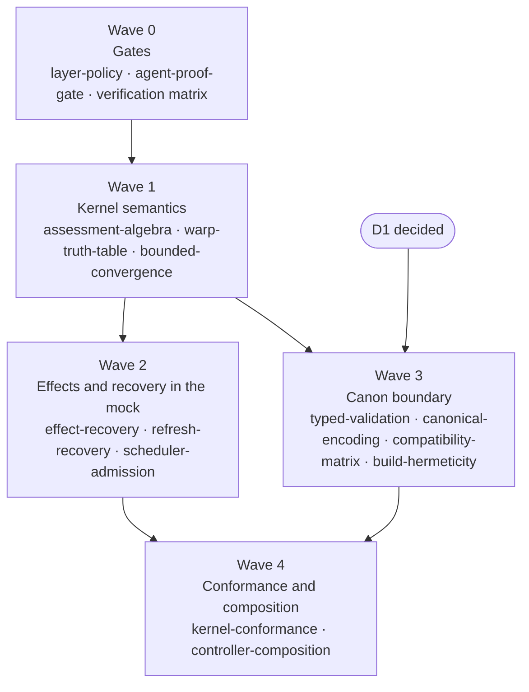

# Phase 0 Grounding Plan

- **Status.** Proposed, 2026-09-28. No experiment has run.
- **Scope.** The 14 experiments the research snapshot marks `phase0`, ordered by the dependencies between the recommendations they test.
- **Exit.** Every experiment has a result record, the ADR candidates it feeds are accepted or explicitly deferred, and the seven counterexamples exist as Rust tests that fail against the draft semantics and pass against the corrected ones.

## Why a Grounding Phase

Spec §55 defines Phase 0 as `nomos-core`, `nomos-canon`, `nomos-substrate-mock`, and `nomos-warp`, with one proof obligation: Canon, Observation, and Variance produce a Plan deterministically. The [snapshot evaluation](README.md) found that the drafts under `docs/formal/` admit outcomes that pipeline must not produce: a converged host reported as non-convergent, a service restarted by an unchanged file, a fence checked before the effect it guards, a repair suppressed by an old completion record. Seven of these reproduce as small models. Spec §54 says uncertain choices are settled by experiment before they are frozen. The grounding phase is that rule applied to the semantics the snapshot put in question, so that the ADRs which freeze them cite evidence rather than a draft.

The phase produces the first real code in the crates. AGENTS.md's skeleton rule lifts for the crates an experiment names, and only for those.

## Rules

- **Design before code.** Each experiment carries a hypothesis, a rival hypothesis, a procedure, measurements, and a decision rule. They are in the graph and repeated in the cards below. Code that does not serve one of them is not part of the phase.
- **Negative controls.** Each experiment includes at least one case the draft semantics fail. A negative control that passes against the draft means the test is not testing. The seven bundle counterexamples are the first negative controls; each is ported to a Rust test in the crate whose semantics it concerns.
- **Result records.** An experiment ends with `results/<experiment>.md`: toolchain and crate versions, the bounds and seeds used, what was established, what was not, and the decision it feeds. A record is written after the run, never before. No cell in a verification matrix says *passed* for planned work.
- **Determinism applies to harnesses.** Property tests record their seeds. Generated graphs and fixtures are reproducible from a seed and a version. A flaky harness is a finding about the harness, not noise.
- **Vocabulary and invariants.** Code and documents use spec §3 terms. An experiment that touches an invariant N1–N12 adds the test for it (AGENTS.md rule 4). A new term or a changed invariant is an ADR, not a commit message.
- **ADR layout.** ADRs keep the repository layout: Status, Date, Context, Decision, Consequences. The candidate's extra sections (Assumptions, Alternatives, Evidence, Verification, Revisit trigger) become subsections of Decision and Consequences, so that an ADR born from an experiment says what was measured and when to look again.
- **No wall-clock, no hash order, no randomness** in anything that feeds compilation or planning (AGENTS.md rule 7). Clocks, deadlines, and identifiers enter the kernel as data.

## Decisions Needed From the User

Three decisions gate parts of the plan. Waves 0 to 2 need none of them.

- **D1. Canon authoring surface.** The specification says YAML with a typed IR (§5, §54). The snapshot assumes a Rust-authored Canon compiled to an inert artifact. Wave 3's `typed-validation`, `canonical-encoding`, and `compatibility-matrix` run on the typed IR and are the same under either answer. `build-hermeticity` only exists for Rust authoring; under the specification's model it collapses into the N12 determinism test. Closing D1 is a specification amendment and the `canon-artifact` ADR.
- **D2. The third `diff` outcome.** Spec §9's `diff` returns Variance or nothing. Wave 1 will implement a per-resource result that also carries *evidence supports neither* with a reason, because the experiment needs it. Whether that outcome gets a name in spec §3, and what it is called, is the `evidence-model` ADR.
- **D3. Edge semantics.** Spec §62 already lists `after` and `on_change` semantics as needing an ADR. Wave 1's `warp-truth-table` produces the table that ADR (`warp-gates`) records. The working definitions in [warp.md](../../formal/warp.md) are the hypothesis.

## Waves

Waves 2 and 3 are independent of each other and can run in parallel once wave 1 is done. Wave 4 needs both, because the TLA+ models cover the transitions wave 2 defines and the conformance replay needs the artifact types wave 3 defines.

| Wave | Experiments | Crates | Feeds |
| --- | --- | --- | --- |
| 0 | `layer-policy`, `agent-proof-gate`, verification matrix | none new to the domain; one tooling crate, see the card | ADR `verification-gates` |
| 1 | `assessment-algebra`, `warp-truth-table`, `bounded-convergence` | `nomos-core`, `nomos-warp`, `nomos-app`, `nomos-substrate-mock` | ADRs `evidence-model`, `warp-gates` |
| 2 | `effect-recovery`, `refresh-recovery`, `scheduler-admission` | `nomos-core`, `nomos-warp`, `nomos-app`, `nomos-substrate-mock` | ADRs `recovery-authority`, `warp-gates` |
| 3 | `typed-validation`, `canonical-encoding`, `compatibility-matrix`, `build-hermeticity` | `nomos-canon`, `nomos-core` | ADR `canon-artifact` |
| 4 | `kernel-conformance`, `controller-composition` | `formal/tla/`, `nomos-app`, `nomos-substrate-mock` | ADRs `verification-gates`, `evidence-model` |

## Wave 0: Gates

Nothing here decides a domain question. It builds the things that make the later results trustworthy.

### layer-policy

- **Question.** Does a check over `cargo metadata` reject a forbidden workspace edge, including one hidden behind a feature or a target-specific dependency?
- **Rival.** Conditional dependencies escape the check, and ordinary compilation is mistaken for policy conformance.
- **Harness.** A tooling binary in `crates/bin/` (the conventional `xtask` shape; `bin/` may depend on anything, and the crate needs an ADR under rule 2, which `verification-gates` supplies) that reads the resolved graph for each supported feature and target set and checks every edge against the table in ADR 0000. The negative control is a fixture workspace under `tests/fixtures/layer-policy/` with a `core` crate that depends on an adapter, once directly, once behind a feature, once under `[target.'cfg(unix)'.dependencies]`. The real workspace is never modified to test the gate.
- **Measurements.** Forbidden edges detected per fixture; feature and target combinations covered.
- **Decision rule.** All three fixture edges are rejected. Wiring the check into CI is a separate ask (AGENTS.md rule 9).

### agent-proof-gate

- **Question.** Do the review rules catch a patch that passes a check by weakening what the check asserts?
- **Rival.** The patch weakens a postcondition, adds an `assume`, `admit`, or `#[ignore]`, or moves code out of the verifier's view, and the green result is accepted.
- **Harness.** Negative-control patches as fixtures under `tests/fixtures/agent-proof/`: one that loosens a postcondition, one that adds an escape hatch to a Kani or Verus harness, one that disables a test, one that unwraps a `forbid(unsafe_code)`. A script diffs specification and assumption changes separately from proof annotations. The gate is a review checklist plus that script; a regular expression cannot detect semantic weakening and the record says so.
- **Measurements.** Escapes detected, false positives, review burden per patch.
- **Decision rule.** Every known invalid shortcut fails the gate. Semantic weakening remains a human review item, recorded as such in AGENTS.md rule 10.

### Verification matrix

Write `docs/formal/verification-matrix.md`. Rows are N1–N12 and the six protocol invariants of spec §48. Columns are property test, TLA+, Kani or Verus, and failure test. Every cell starts as *not run* with a link to the experiment that will fill it. The matrix is the honest ledger the later waves write into, and its first version is entirely empty by design.

## Wave 1: Kernel Semantics

The heart of Phase 0. Three experiments, all on the mock, all in pure code, each with a bundle counterexample as its first negative control.

### assessment-algebra

- **Question.** Is a per-resource three-way result, with conjunction across a Canon, enough for the six initial resources?
- **Rival.** An aggregate shortcut collapses unknown, absent, stale, or contradictory evidence into one of the two existing outcomes.
- **Harness.** In `nomos-core`: a per-resource result type with satisfied, Variance carrying its evidence, and a third outcome carrying a reason (denied read, stale observation, conflicting observations). A truth table for conjunction, generated exhaustively for pairs and by `proptest` for longer conjunctions. Observation fixtures for present, absent, stale, denied, and conflicting. If D2 is not yet decided, the third outcome carries no spec §3 name.
- **Negative controls.** `partial-assessment`: a known Variance beside an unknown must still report the Variance. A permission error must never become absent or Variance. An empty error list must not be read as satisfied.
- **Measurements.** Truth-table agreement, count of mutation admissions from an unknown, evaluation bound for any bounded typed expressions Canon parameters need (spec §5 restricts conditional expressions; the bound is the test that they stay restricted).
- **Decision rule.** No unknown is cast to Variance, and no unrelated unknown hides a known Variance. Feeds `evidence-model`.

### warp-truth-table

- **Question.** Do explicit start conditions, activation, and satisfaction anchors fully specify v0 dependencies?
- **Rival.** Terminal, changed, and succeeded are conflated, or a satisfied prerequisite with no Action breaks the graph.
- **Harness.** In `nomos-warp`: the table of predecessor outcome by edge kind, resolved to waiting, satisfied, disabled, or blocked, as [warp.md](../../formal/warp.md) now defines them. Random DAGs from `proptest` with every insertion-order permutation of the same graph. Multi-source `on_change` under the *any* working definition. Cycle witnesses checked to be cycles in $E$.
- **Negative controls.** `activation-missing`: an unchanged configuration must not activate a restart. A satisfied user prerequisite must let a directory Action run without a user Action. A failed partial write must not activate its dependent restart.
- **Measurements.** Activation correctness against the table, order determinism across permutations (N12), witness validity.
- **Decision rule.** Every case resolves to exactly one of the four states with no fallthrough. Feeds `warp-gates` and closes D3.

### bounded-convergence

- **Question.** Does the loop report the right outcome at the bound without hiding effects still in flight?
- **Rival.** The last successful execution is misreported, or slow asynchronous completion is classified as oscillation.
- **Harness.** In `nomos-app` against `nomos-substrate-mock`: the loop as [reconciliation.md](../../formal/reconciliation.md) now states it. Mock resources with scripted behavior: converge on attempt $k$, never converge, complete one observation late, oscillate against a scripted external writer, change unrelated telemetry every observation. Deadlines injected as data.
- **Negative controls.** `final-check`: $k = 1$ with a successful mutation must return `Converged`. A slow completion must not be reported as oscillation.
- **Measurements.** Outcome classification per script, observation count, count of Actions left unsettled at exit.
- **Decision rule.** The loop distinguishes converged, bound reached, known failure, and unknown outcome, and never reports converged with an Action unsettled. Feeds `evidence-model` (freshness) and the N2, N3, and N10 rows of the matrix.

## Wave 2: Effects and Recovery in the Mock

Still no operating system. The mock gains a scripted crash boundary: the kernel is driven step by step, and a crash is the harness dropping an effect's result.

### effect-recovery

- **Question.** Do run-scoped idempotency keys deduplicate retries within one execution while allowing later repairs?
- **Rival.** A content-derived key suppresses drift repair, or a retry overlaps a still-live operation.
- **Harness.** In `nomos-core` and `nomos-app`: the key scoping [fencing-and-idempotency.md](../../formal/fencing-and-idempotency.md) now states. Duplicate deliveries before, during, and after completion. New drift after completion followed by a new run with the same semantic Action. One scripted effect with no readable postcondition.
- **Negative controls.** `dedup-scope`: a completed record from run one must not suppress the repair in run two.
- **Measurements.** Duplicate live effects, suppressed repairs, unsafe retries, effects left explicitly unresolved.
- **Decision rule.** No silent re-execution and no silent suppression. An effect without a readable postcondition stays unresolved and says so (N10). Feeds `recovery-authority`.

### refresh-recovery

- **Question.** Which of three designs keeps a service refresh obligation across a crash between file replacement and restart: a durable obligation persisted before the replacement, an observable loaded-revision property on the service, or the draft's transient `on_change`?
- **Rival.** The file comparison after recovery sees no Variance and the refresh is lost, or a restart receipt is mistaken for evidence that the new revision loaded.
- **Harness.** A mock service with separate disk and loaded configuration revisions. Crash at every step boundary before and after replacement and refresh. All three designs implemented against the same script.
- **Negative controls.** `lost-refresh`: the transient design must lose the refresh; the test proves the harness sees it.
- **Measurements.** Lost refreshes, unnecessary refreshes, outcomes left unresolved, per design.
- **Decision rule.** No declared obligation disappears. For a service that cannot report its loaded revision, the record states the uncertainty and retry policy rather than claiming exactly-once refresh. Feeds `warp-gates`.

### scheduler-admission

- **Question.** Is a serialized, reservation-based greedy selection safe under declared footprints, budgets, and involuntary failures?
- **Rival.** Concurrent admission, aliased resource keys, implicit effects, or unresolved jobs bypass the reservations.
- **Harness.** In `nomos-warp`: the selection in [warp.md](../../formal/warp.md) with reservations held through dispatch, verification, and unknown outcomes. Generated ready sets and footprints. Interleavings of reserve, dispatch, timeout, verify, and release explored with the `loom` model checker under its alias (spec §47). Scripted involuntary node failures and repeated task arrivals for the budget and fairness cases.
- **Negative controls.** `budget-not-world`: an involuntary failure past the budget must pause further disruptive admission, not be reported as a budget violation by the scheduler. A reservation released at `Running` exit must allow a conflicting overlap with a timed-out Action, and the corrected reservation must not.
- **Measurements.** Conflicting overlaps, budget admission violations, starvation under the stated fairness premise.
- **Decision rule.** No modeled conflict or oversubscription. Maximality and fairness are claimed only under the premises the record states. Feeds `warp-gates` and `recovery-authority` (the N9 part).

## Wave 3: Canon Boundary

Runs on the typed IR. Three of the four experiments are the same under either answer to D1.

### typed-validation

- **Question.** Do construction, decoding, and migration enforce the same domain invariants?
- **Rival.** Derived deserialization, a public field, or a migration constructs a value the constructor would reject.
- **Harness.** In `nomos-canon` and `nomos-core`: decode into untrusted data-transfer objects, then fallible conversion into validated types with private fields. Generated valid and malformed inputs: bad ranges, duplicate resource identifiers, dangling `requires` references, unknown resource kinds, oversized inputs. Compile-fail cases for constructing a validated type outside its module. The sum-type countercase: an absent file with content must be unrepresentable, not merely rejected.
- **Negative controls.** A `serde` derive on the validated type without a `try_from` boundary must let a malformed value through; the test proves the harness detects it.
- **Measurements.** Rejection parity across the three paths, panic count (target zero), size of the smallest counterexample `proptest` finds.
- **Decision rule.** No malformed input becomes a validated Canon by any supported path, and every error is typed and contains no Cipher material. Feeds `canon-artifact`.

### canonical-encoding

- **Question.** Which restricted profile, deterministic Concise Binary Object Representation (CBOR, RFC 8949 §4.2) or the JSON Canonicalization Scheme (JCS, RFC 8785), represents the IR so that semantic equivalence and byte equality coincide?
- **Rival.** Number, Unicode, map ordering, duplicate keys, or default handling breaks the equivalence in one of them.
- **Harness.** Define the semantic equivalences first: field order, defaults, integer ranges, path bytes, forbidden floats. Golden vectors and adversarial fixtures encoded by both profiles, decoded by an independent decoder, and compared across two builds. `CanonID` is the hash of a domain tag, a version, and the normalized content; provenance stays outside the hash.
- **Negative controls.** Two semantically different Canons that a naive normalization collapses must keep distinct identities.
- **Measurements.** Golden-vector agreement, artifact size, encode and decode cost, dependency count.
- **Decision rule.** The simpler profile that passes every semantic test. Throughput alone decides nothing. Feeds `canon-artifact` and closes the encoding open question.

### compatibility-matrix

- **Question.** Do explicit schema versions and migrations preserve accepted semantics across old and new readers?
- **Rival.** An unknown variant or a changed default silently changes executable intent.
- **Harness.** Version 1 and version 2 fixtures exchanged between old and new readers. Unknown resource capabilities and unknown mutating variants. Migrations that keep the original bytes and record lineage.
- **Negative controls.** An unknown mutating variant accepted for forward compatibility must be caught before any effect.
- **Measurements.** Silent semantic changes, correct rejections, identity consistency across migration.
- **Decision rule.** Unsupported execution fails before effect. Archival preservation never implies permission to execute. Feeds `canon-artifact`.

### build-hermeticity

Only under D1 = Rust authoring. Otherwise the experiment reduces to the N12 determinism test in wave 3's other cards and is recorded as such.

- **Question.** Do two isolated builds with the same declared inputs produce the same canonical artifact, and is every undeclared input denied?
- **Rival.** Wall clock, locale, temporary paths, hash seeds, environment, or network reach the generator and change the output.
- **Harness.** The same Canon crate built twice in isolated environments with each ambient input varied. Declared inputs recorded. Undeclared reads and network attempts observed, not assumed absent.
- **Decision rule.** Adopt the pipeline only after each undeclared-input path is denied or recorded. Identical outputs alone prove nothing about hermeticity.

## Wave 4: Conformance and Composition

### kernel-conformance

- **Question.** Can the transition kernel from waves 1 and 2 be modeled in TLA+ with explicit bounds, and do its counterexample traces replay through the Rust tests?
- **Rival.** The model omits an implementation transition or assumes more of the adapters than they promise.
- **Harness.** `formal/tla/ActionLifecycle.tla`, `PlanExecution.tla`, and `Fencing.tla` as spec §48 plans, with state bounds recorded. TLC counterexample traces exported and replayed through `nomos-app` against the mock. One Kani or Verus harness on one pure function, the readiness predicate being the obvious candidate, to learn the cost before adopting a verifier.
- **Negative controls.** A known-bad transition inserted into the Rust kernel must produce a trace the model rejects.
- **Measurements.** Transitions mapped between model and code, negative-control failures, model bounds, check time.
- **Decision rule.** The record names exactly which properties were checked, under which bounds, and with which adapters trusted. A finite-model check is not called a proof. Feeds `verification-gates` and fills the TLA+ column of the matrix.

### controller-composition

- **Question.** Do explicit read and write footprints with stated guarantees and reliance assumptions detect a harmful composition of two controllers that each converge alone?
- **Rival.** The two controllers oscillate together and nothing in the model sees it.
- **Harness.** Two mock controllers sharing a file or a sysctl. Three configurations: shared ownership, single owner, disjoint properties. Footprints, own guarantees, and peer assumptions declared as data. The discipline is Anvil's and Welder's; the object model is Nomos's, not Kubernetes's.
- **Negative controls.** The shared-ownership configuration must oscillate and must be detected or rejected by the ownership rule.
- **Measurements.** Composed convergence, interference counterexamples, annotation cost.
- **Decision rule.** One safe composition demonstrated and one counterexample detected before any whole-host claim. Feeds `evidence-model` (ownership) and the Known Gaps in `reconciliation.md`.

## Deferred Beyond Grounding

These experiments are in the graph and are not Phase 0 work. They are listed so nobody mistakes their absence for an oversight.

| Experiment | Phase | Reason |
| --- | --- | --- |
| `substrate-contract` | 1 | Needs Linux: symlink races, aliases, foreign writers |
| `event-crash-replay` | 2 | Needs the durable store and the outbox decision |
| `fence-interleavings` | 3–4 | Needs Loom and a second authority to supersede |
| `identity-rollback` | 3–4 | Needs enrollment, snapshots, and clones |
| `secret-nondisclosure` | 6 | Needs a Cipher provider adapter |
| `incremental-ablation` | after 0 | Needs the full recomputation path as the reference |
| `plan-witness` | after 0 | Needs a baseline planner to check against |

## Exit Criteria

1. Fourteen result records under `results/`, each with a decision, none claiming more than it ran.
2. The seven bundle counterexamples exist as Rust tests, fail against the draft semantics, and pass against the corrected ones.
3. ADRs accepted or explicitly deferred: `verification-gates`, `evidence-model`, `warp-gates`, `recovery-authority` (the Phase 0 part), and `canon-artifact` or a recorded deferral of D1.
4. `docs/formal/verification-matrix.md` filled from the records, with *not run* wherever nothing ran.
5. Spec §62 updated: edge semantics closed, the third `diff` outcome closed or named as open, the encoding question closed.
6. The four Cargo checks and the docs lint pass on the closing commit.
